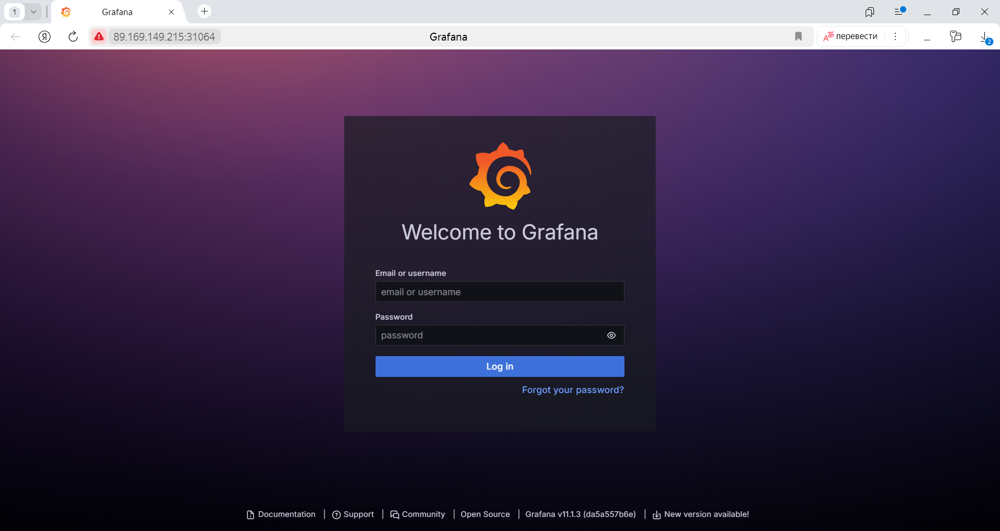
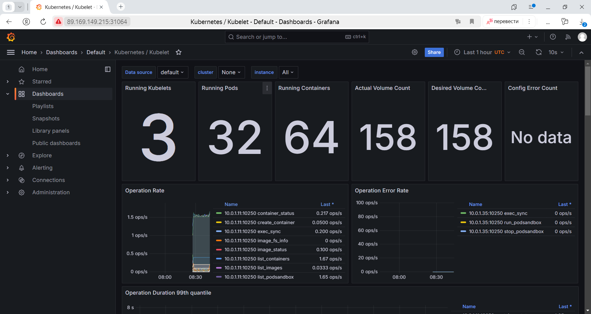
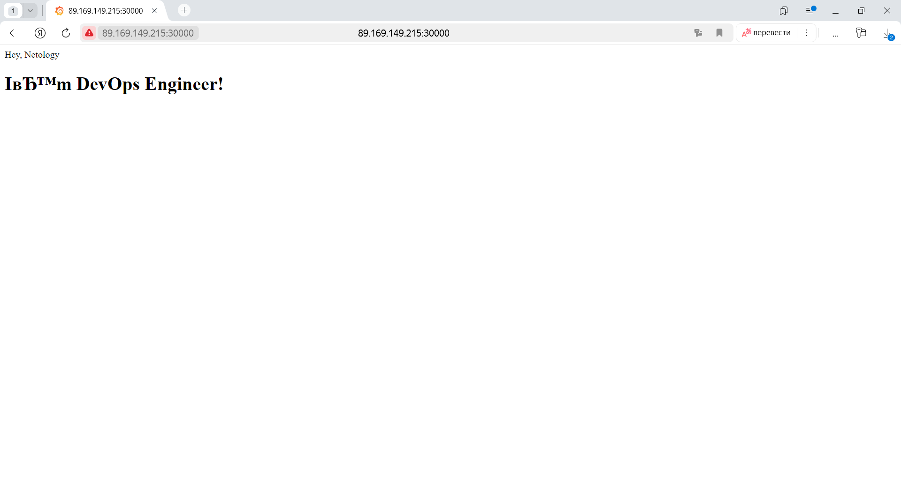

# Подготовка cистемы мониторинга и деплой приложения
<details>
	<summary></summary>
      <br>

Уже должны быть готовы конфигурации для автоматического создания облачной инфраструктуры и поднятия Kubernetes кластера.  
Теперь необходимо подготовить конфигурационные файлы для настройки нашего Kubernetes кластера.

Цель:
1. Задеплоить в кластер [prometheus](https://prometheus.io/), [grafana](https://grafana.com/), [alertmanager](https://github.com/prometheus/alertmanager), [экспортер](https://github.com/prometheus/node_exporter) основных метрик Kubernetes.
2. Задеплоить тестовое приложение, например, [nginx](https://www.nginx.com/) сервер отдающий статическую страницу.

Способ выполнения:
1. Воспользоваться пакетом [kube-prometheus](https://github.com/prometheus-operator/kube-prometheus), который уже включает в себя [Kubernetes оператор](https://operatorhub.io/) для [grafana](https://grafana.com/), [prometheus](https://prometheus.io/), [alertmanager](https://github.com/prometheus/alertmanager) и [node_exporter](https://github.com/prometheus/node_exporter). Альтернативный вариант - использовать набор helm чартов от [bitnami](https://github.com/bitnami/charts/tree/main/bitnami).

2. Если на первом этапе вы не воспользовались [Terraform Cloud](https://app.terraform.io/), то задеплойте и настройте в кластере [atlantis](https://www.runatlantis.io/) для отслеживания изменений инфраструктуры. Альтернативный вариант 3 задания: вместо Terraform Cloud или atlantis настройте на автоматический запуск и применение конфигурации terraform из вашего git-репозитория в выбранной вами CI-CD системе при любом комите в main ветку. Предоставьте скриншоты работы пайплайна из CI/CD системы.

Ожидаемый результат:
1. Git репозиторий с конфигурационными файлами для настройки Kubernetes.
2. Http доступ к web интерфейсу grafana.
3. Дашборды в grafana отображающие состояние Kubernetes кластера.
4. Http доступ к тестовому приложению.

</details>

---
## Решение:

### 4.1 Деплой в кластер prometheus, grafana, alertmanager, экспортер основных метрик Kubernetes.

Для решения задачи деплоя в кластер prometheus, grafana, alertmanager, экспортер основных метрик Kubernetes воспользуемся решением [kube-prometheus](https://github.com/prometheus-operator/kube-prometheus).

Склонируем репозиторий
```bash
git clone https://github.com/prometheus-operator/kube-prometheus.git
```

Переходим в папку с kube-prometheus
```bash
cd kube-prometheus/
```

Создадим мониторинг стека с использование конфигурации в manifests каталоге:
```bash
kubectl apply --server-side -f manifests/setup
kubectl wait \
 --for condition=Established \
 --all CustomResourceDefinition \
 --namespace=monitoring
kubectl apply -f manifests/
```

Убедимся, что маниторинг развернулся и работает:
```bash
debian@fhmbb7q6q8m12ktto9qc:~/kube-prometheus$ kubectl get all -n monitoring
NAME                                       READY   STATUS    RESTARTS   AGE
pod/alertmanager-main-0                    2/2     Running   0          104s
pod/alertmanager-main-1                    2/2     Running   0          104s
pod/alertmanager-main-2                    2/2     Running   0          104s
pod/blackbox-exporter-597d86cf5c-w8c2q     3/3     Running   0          119s
pod/grafana-549c49555-zg8tr                1/1     Running   0          119s
pod/kube-state-metrics-789f4b647d-vcnwv    3/3     Running   0          118s
pod/node-exporter-dlg58                    2/2     Running   0          118s
pod/node-exporter-fwdqz                    2/2     Running   0          118s
pod/node-exporter-lsqgw                    2/2     Running   0          118s
pod/prometheus-adapter-5794d7d9f5-6q6n5    1/1     Running   0          117s
pod/prometheus-adapter-5794d7d9f5-xhl4r    1/1     Running   0          117s
pod/prometheus-k8s-0                       2/2     Running   0          103s
pod/prometheus-k8s-1                       2/2     Running   0          103s
pod/prometheus-operator-7d9bfb969b-lmsb6   2/2     Running   0          117s

NAME                            TYPE        CLUSTER-IP      EXTERNAL-IP   PORT(S)                      AGE
service/alertmanager-main       ClusterIP   10.233.30.240   <none>        9093/TCP,8080/TCP            119s
service/alertmanager-operated   ClusterIP   None            <none>        9093/TCP,9094/TCP,9094/UDP   104s
service/blackbox-exporter       ClusterIP   10.233.16.176   <none>        9115/TCP,19115/TCP           119s
service/grafana                 ClusterIP   10.233.47.178   <none>        3000/TCP                     119s
service/kube-state-metrics      ClusterIP   None            <none>        8443/TCP,9443/TCP            118s
service/node-exporter           ClusterIP   None            <none>        9100/TCP                     118s
service/prometheus-adapter      ClusterIP   10.233.8.128    <none>        443/TCP                      117s
service/prometheus-k8s          ClusterIP   10.233.22.119   <none>        9090/TCP,8080/TCP            118s
service/prometheus-operated     ClusterIP   None            <none>        9090/TCP                     103s
service/prometheus-operator     ClusterIP   None            <none>        8443/TCP                     117s

NAME                           DESIRED   CURRENT   READY   UP-TO-DATE   AVAILABLE   NODE SELECTOR            AGE
daemonset.apps/node-exporter   3         3         3       3            3           kubernetes.io/os=linux   118s

NAME                                  READY   UP-TO-DATE   AVAILABLE   AGE
deployment.apps/blackbox-exporter     1/1     1            1           119s
deployment.apps/grafana               1/1     1            1           119s
deployment.apps/kube-state-metrics    1/1     1            1           118s
deployment.apps/prometheus-adapter    2/2     2            2           118s
deployment.apps/prometheus-operator   1/1     1            1           117s

NAME                                             DESIRED   CURRENT   READY   AGE
replicaset.apps/blackbox-exporter-597d86cf5c     1         1         1       119s
replicaset.apps/grafana-549c49555                1         1         1       119s
replicaset.apps/kube-state-metrics-789f4b647d    1         1         1       118s
replicaset.apps/prometheus-adapter-5794d7d9f5    2         2         2       118s
replicaset.apps/prometheus-operator-7d9bfb969b   1         1         1       117s

NAME                                 READY   AGE
statefulset.apps/alertmanager-main   3/3     104s
statefulset.apps/prometheus-k8s      2/2     103s
```

Чтобы подключиться снаружи к Grafana необходимо изменить порт с ClusterIP на NodePort
```bash
baryshnikov@compute-vm-2-4-20-hdd-1723564389639:~/kube-prometheus$ cat <<EOF > ~/patch.yml
spec:
  type: NodePort
EOF
baryshnikov@compute-vm-2-4-20-hdd-1723564389639:~/kube-prometheus$
baryshnikov@compute-vm-2-4-20-hdd-1723564389639:~/kube-prometheus$
baryshnikov@compute-vm-2-4-20-hdd-1723564389639:~/kube-prometheus$ kubectl patch svc grafana -n monitoring --patch-file ~/patch.yml
service/grafana patched
```

Проверим изменения
```bash
debian@fhmbb7q6q8m12ktto9qc:~/kube-prometheus$ kubectl get svc -n monitoring
NAME                    TYPE        CLUSTER-IP      EXTERNAL-IP   PORT(S)                      AGE
alertmanager-main       ClusterIP   10.233.30.240   <none>        9093/TCP,8080/TCP            5m18s
alertmanager-operated   ClusterIP   None            <none>        9093/TCP,9094/TCP,9094/UDP   5m3s
blackbox-exporter       ClusterIP   10.233.16.176   <none>        9115/TCP,19115/TCP           5m18s
grafana                 NodePort    10.233.47.178   <none>        3000:31064/TCP               5m18s
kube-state-metrics      ClusterIP   None            <none>        8443/TCP,9443/TCP            5m17s
node-exporter           ClusterIP   None            <none>        9100/TCP                     5m17s
prometheus-adapter      ClusterIP   10.233.8.128    <none>        443/TCP                      5m16s
prometheus-k8s          ClusterIP   10.233.22.119   <none>        9090/TCP,8080/TCP            5m17s
prometheus-operated     ClusterIP   None            <none>        9090/TCP                     5m2s
prometheus-operator     ClusterIP   None            <none>        8443/TCP                     5m16s
```

Проверим Http доступ к web интерфейсу grafana:


Выведем в grafana Дашборды отображающие состояние Kubernetes кластера:


---
### 4.2 Деплой тестового приложения, например, nginx сервер отдающий статическую страницу.

Создадим папку для приложения и перейдем в нее `mkdir application && cd application`

Создадим namespace application для приложения

application-ns.yml
```yml
apiVersion: v1
kind: Namespace
metadata:
  name: application
```

Создадим DeamonSet, чтобы развернуть приложение на все worker-node:

Nginx-DaemonSet.yml
```yml
apiVersion: apps/v1
kind: DaemonSet
metadata:
  name: nginx-deamonset
  namespace: application
spec:
  selector:
    matchLabels:
      app: daemonset
  template:
    metadata:
      labels:
        app: daemonset
    spec:
      containers:
      - name: nginx
        image: baryshnikovnv/nginx:v1
```

Создадим Service для приложения с возможностью доступа снаружи кластера к nginx, используя тип порта NodePort.

Nginx-Service.yml
```yml
apiVersion: v1
kind: Service
metadata:
  name: nginx-service
  namespace: application
spec:
  ports:
    - name: nginx
      port: 80
      protocol: TCP
      targetPort: 80
      nodePort: 30000
  selector:
    app: daemonset
  type: NodePort
```

Для развертывания приложения воспользуемся инструментом Kustomize

kustomization.yml
```yml
namespace: application
resources:
- application-ns.yml
- Nginx-DaemonSet.yml
- Nginx-Service.yml
```

Развернем приложение
```bash
debian@fhmbb7q6q8m12ktto9qc:~/application$ kubectl get all -n application
NAME                        READY   STATUS    RESTARTS   AGE
pod/nginx-deamonset-f8wht   1/1     Running   0          10s
pod/nginx-deamonset-hbh6z   1/1     Running   0          10s

NAME                    TYPE       CLUSTER-IP     EXTERNAL-IP   PORT(S)        AGE
service/nginx-service   NodePort   10.233.60.80   <none>        80:30000/TCP   10s

NAME                             DESIRED   CURRENT   READY   UP-TO-DATE   AVAILABLE   NODE SELECTOR   AGE
daemonset.apps/nginx-deamonset   2         2         2       2            2           <none>          10s
```

Проверим Http доступ к тестовому приложению:
