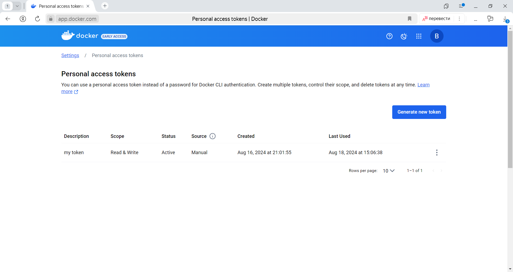
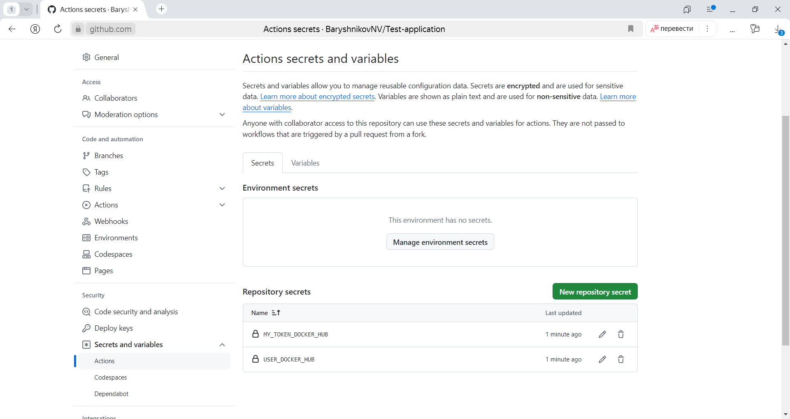
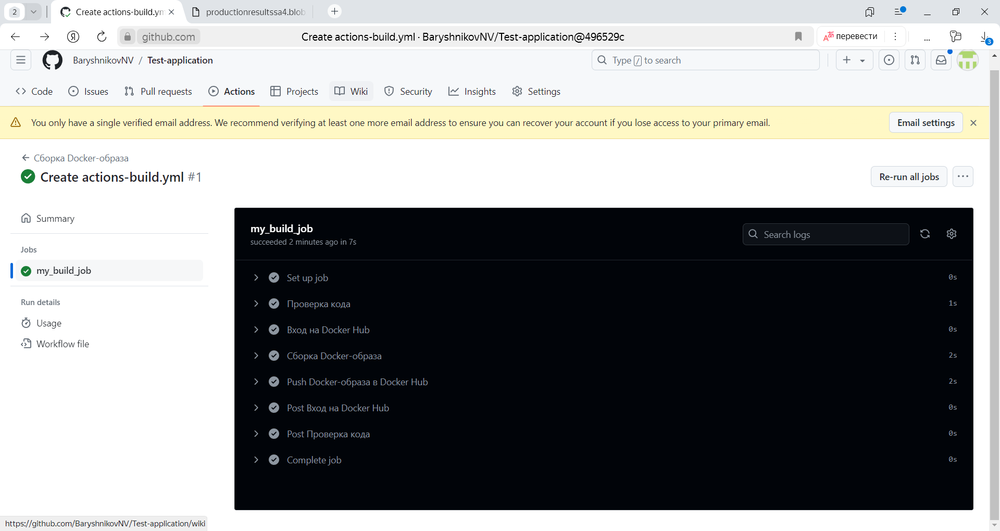
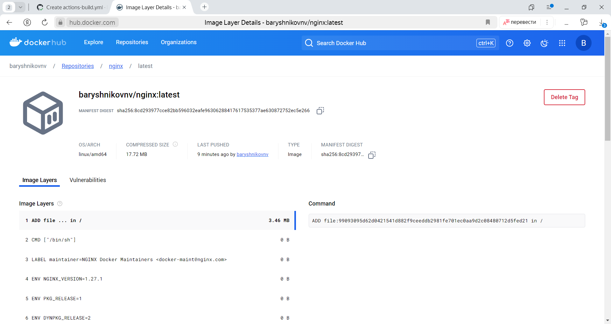
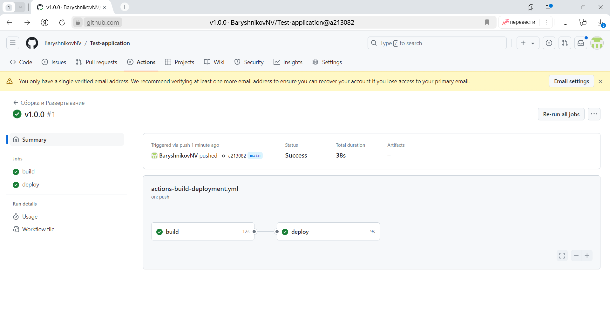
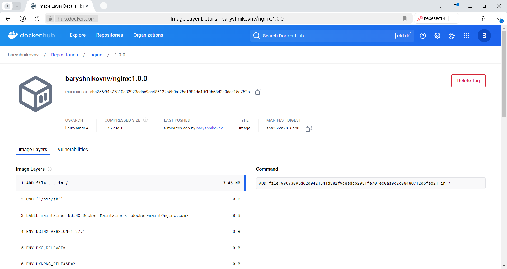

# Установка и настройка CI/CD
<details>
	<summary></summary>
      <br>

Осталось настроить ci/cd систему для автоматической сборки docker image и деплоя приложения при изменении кода.

Цель:

1. Автоматическая сборка docker образа при коммите в репозиторий с тестовым приложением.
2. Автоматический деплой нового docker образа.

Можно использовать [teamcity](https://www.jetbrains.com/ru-ru/teamcity/), [jenkins](https://www.jenkins.io/), [GitLab CI](https://about.gitlab.com/stages-devops-lifecycle/continuous-integration/) или GitHub Actions.

Ожидаемый результат:

1. Интерфейс ci/cd сервиса доступен по http.
2. При любом коммите в репозиторие с тестовым приложением происходит сборка и отправка в регистр Docker образа.
3. При создании тега (например, v1.0.0) происходит сборка и отправка с соответствующим label в регистри, а также деплой соответствующего Docker образа в кластер Kubernetes.

</details>

---
## Решение:

Настроим ci/cd систему для автоматической сборки docker image и деплоя приложения при изменении кода.

### 5.1 Автоматическая сборка docker образа при коммите в репозиторий с тестовым приложением.

Для автоматической сборки и docker-образа при коммите в репозиторий с тестовым приложением воспользуемся платформой CI/CD GitHub Actions.

Создадим в DockerHub секретный токен `my token`.


Добавим токен в `Settings -> Secrets and variables -> Actions secrets and variables` в переменную `MY_TOKEN_DOCKER_HUB`.  
В переменную `USER_DOCKER_HUB` добавим имя пользователя от Docker Hub `baryshnikovnv`.  



Далее, создадим `workflow` файл для автоматической сборки приложения nginx:  
Перейдем на вкладку `Actions`, выполним `New workflow`, затем `Simple workflow` (Config). Создадим файл `../.github/workflows/actions-build.yml`.

actions-build.yml
```yml
name: Сборка Docker-образа

on:
  push:
    branches:
      - '*'
jobs:
  my_build_job:
    runs-on: ubuntu-latest

    steps:
      - name: Проверка кода
        uses: actions/checkout@v4

      - name: Вход на Docker Hub
        uses: docker/login-action@v2
        with:
          username: ${{ secrets.USER_DOCKER_HUB }}
          password: ${{ secrets.MY_TOKEN_DOCKER_HUB }}

      - name: Сборка Docker-образа
        run: |
          docker build . --file Dockerfile --tag nginx:latest
          docker tag nginx:latest ${{ secrets.USER_DOCKER_HUB }}/nginx:latest

      - name: Push Docker-образа в Docker Hub
        run: |
          docker push ${{ secrets.USER_DOCKER_HUB }}/nginx:latest
```

Выполним commit.

Перейдем в раздел **Actions**, где видим, что `Workflow file` успешно выполнился.


Лог выполнения `Workflow file`:
<details>
	<summary></summary>
      <br>

```
2024-08-18T10:24:40.0910700Z Current runner version: '2.319.1'
2024-08-18T10:24:40.0933060Z ##[group]Operating System
2024-08-18T10:24:40.0933728Z Ubuntu
2024-08-18T10:24:40.0934041Z 22.04.4
2024-08-18T10:24:40.0934456Z LTS
2024-08-18T10:24:40.0934811Z ##[endgroup]
2024-08-18T10:24:40.0935187Z ##[group]Runner Image
2024-08-18T10:24:40.0935933Z Image: ubuntu-22.04
2024-08-18T10:24:40.0936332Z Version: 20240811.1.0
2024-08-18T10:24:40.0937332Z Included Software: https://github.com/actions/runner-images/blob/ubuntu22/20240811.1/images/ubuntu/Ubuntu2204-Readme.md
2024-08-18T10:24:40.0938853Z Image Release: https://github.com/actions/runner-images/releases/tag/ubuntu22%2F20240811.1
2024-08-18T10:24:40.0939764Z ##[endgroup]
2024-08-18T10:24:40.0940162Z ##[group]Runner Image Provisioner
2024-08-18T10:24:40.0940685Z 2.0.374.1
2024-08-18T10:24:40.0941025Z ##[endgroup]
2024-08-18T10:24:40.0955676Z ##[group]GITHUB_TOKEN Permissions
2024-08-18T10:24:40.0957303Z Contents: read
2024-08-18T10:24:40.0957826Z Metadata: read
2024-08-18T10:24:40.0958420Z Packages: read
2024-08-18T10:24:40.0958957Z ##[endgroup]
2024-08-18T10:24:40.0961830Z Secret source: Actions
2024-08-18T10:24:40.0962552Z Prepare workflow directory
2024-08-18T10:24:40.1574826Z Prepare all required actions
2024-08-18T10:24:40.1729699Z Getting action download info
2024-08-18T10:24:40.3291228Z Download action repository 'actions/checkout@v4' (SHA:692973e3d937129bcbf40652eb9f2f61becf3332)
2024-08-18T10:24:40.4189012Z Download action repository 'docker/login-action@v2' (SHA:465a07811f14bebb1938fbed4728c6a1ff8901fc)
2024-08-18T10:24:40.7419402Z Complete job name: my_build_job
2024-08-18T10:24:40.8335287Z ##[group]Run actions/checkout@v4
2024-08-18T10:24:40.8336410Z with:
2024-08-18T10:24:40.8336945Z   repository: BaryshnikovNV/Test-application
2024-08-18T10:24:40.8337750Z   token: ***
2024-08-18T10:24:40.8338161Z   ssh-strict: true
2024-08-18T10:24:40.8338646Z   ssh-user: git
2024-08-18T10:24:40.8339087Z   persist-credentials: true
2024-08-18T10:24:40.8339520Z   clean: true
2024-08-18T10:24:40.8340020Z   sparse-checkout-cone-mode: true
2024-08-18T10:24:40.8340553Z   fetch-depth: 1
2024-08-18T10:24:40.8340942Z   fetch-tags: false
2024-08-18T10:24:40.8341418Z   show-progress: true
2024-08-18T10:24:40.8341804Z   lfs: false
2024-08-18T10:24:40.8342191Z   submodules: false
2024-08-18T10:24:40.8342683Z   set-safe-directory: true
2024-08-18T10:24:40.8343124Z ##[endgroup]
2024-08-18T10:24:41.0086281Z Syncing repository: BaryshnikovNV/Test-application
2024-08-18T10:24:41.0088554Z ##[group]Getting Git version info
2024-08-18T10:24:41.0089883Z Working directory is '/home/runner/work/Test-application/Test-application'
2024-08-18T10:24:41.0091312Z [command]/usr/bin/git version
2024-08-18T10:24:41.0091820Z git version 2.46.0
2024-08-18T10:24:41.0093550Z ##[endgroup]
2024-08-18T10:24:41.0111282Z Temporarily overriding HOME='/home/runner/work/_temp/301091fc-d82f-4c0d-af4a-ac190e7bbfe8' before making global git config changes
2024-08-18T10:24:41.0113003Z Adding repository directory to the temporary git global config as a safe directory
2024-08-18T10:24:41.0116375Z [command]/usr/bin/git config --global --add safe.directory /home/runner/work/Test-application/Test-application
2024-08-18T10:24:41.0151127Z Deleting the contents of '/home/runner/work/Test-application/Test-application'
2024-08-18T10:24:41.0154463Z ##[group]Initializing the repository
2024-08-18T10:24:41.0159432Z [command]/usr/bin/git init /home/runner/work/Test-application/Test-application
2024-08-18T10:24:41.0226519Z hint: Using 'master' as the name for the initial branch. This default branch name
2024-08-18T10:24:41.0227793Z hint: is subject to change. To configure the initial branch name to use in all
2024-08-18T10:24:41.0228984Z hint: of your new repositories, which will suppress this warning, call:
2024-08-18T10:24:41.0230137Z hint:
2024-08-18T10:24:41.0230906Z hint: 	git config --global init.defaultBranch <name>
2024-08-18T10:24:41.0232043Z hint:
2024-08-18T10:24:41.0233212Z hint: Names commonly chosen instead of 'master' are 'main', 'trunk' and
2024-08-18T10:24:41.0235492Z hint: 'development'. The just-created branch can be renamed via this command:
2024-08-18T10:24:41.0237019Z hint:
2024-08-18T10:24:41.0237802Z hint: 	git branch -m <name>
2024-08-18T10:24:41.0239561Z Initialized empty Git repository in /home/runner/work/Test-application/Test-application/.git/
2024-08-18T10:24:41.0243963Z [command]/usr/bin/git remote add origin https://github.com/BaryshnikovNV/Test-application
2024-08-18T10:24:41.0277508Z ##[endgroup]
2024-08-18T10:24:41.0278933Z ##[group]Disabling automatic garbage collection
2024-08-18T10:24:41.0282268Z [command]/usr/bin/git config --local gc.auto 0
2024-08-18T10:24:41.0313153Z ##[endgroup]
2024-08-18T10:24:41.0314485Z ##[group]Setting up auth
2024-08-18T10:24:41.0320397Z [command]/usr/bin/git config --local --name-only --get-regexp core\.sshCommand
2024-08-18T10:24:41.0351679Z [command]/usr/bin/git submodule foreach --recursive sh -c "git config --local --name-only --get-regexp 'core\.sshCommand' && git config --local --unset-all 'core.sshCommand' || :"
2024-08-18T10:24:41.0661454Z [command]/usr/bin/git config --local --name-only --get-regexp http\.https\:\/\/github\.com\/\.extraheader
2024-08-18T10:24:41.0696224Z [command]/usr/bin/git submodule foreach --recursive sh -c "git config --local --name-only --get-regexp 'http\.https\:\/\/github\.com\/\.extraheader' && git config --local --unset-all 'http.https://github.com/.extraheader' || :"
2024-08-18T10:24:41.0958691Z [command]/usr/bin/git config --local http.https://github.com/.extraheader AUTHORIZATION: basic ***
2024-08-18T10:24:41.1001430Z ##[endgroup]
2024-08-18T10:24:41.1002489Z ##[group]Fetching the repository
2024-08-18T10:24:41.1013706Z [command]/usr/bin/git -c protocol.version=2 fetch --no-tags --prune --no-recurse-submodules --depth=1 origin +496529cf9e3c33636cfbca083a1e626c13a238c8:refs/remotes/origin/main
2024-08-18T10:24:41.2928576Z From https://github.com/BaryshnikovNV/Test-application
2024-08-18T10:24:41.2930297Z  * [new ref]         496529cf9e3c33636cfbca083a1e626c13a238c8 -> origin/main
2024-08-18T10:24:41.2952026Z ##[endgroup]
2024-08-18T10:24:41.2952844Z ##[group]Determining the checkout info
2024-08-18T10:24:41.2954257Z ##[endgroup]
2024-08-18T10:24:41.2958883Z [command]/usr/bin/git sparse-checkout disable
2024-08-18T10:24:41.2996952Z [command]/usr/bin/git config --local --unset-all extensions.worktreeConfig
2024-08-18T10:24:41.3025191Z ##[group]Checking out the ref
2024-08-18T10:24:41.3028533Z [command]/usr/bin/git checkout --progress --force -B main refs/remotes/origin/main
2024-08-18T10:24:41.3070815Z Switched to a new branch 'main'
2024-08-18T10:24:41.3074076Z branch 'main' set up to track 'origin/main'.
2024-08-18T10:24:41.3080034Z ##[endgroup]
2024-08-18T10:24:41.3115422Z [command]/usr/bin/git log -1 --format='%H'
2024-08-18T10:24:41.3139063Z '496529cf9e3c33636cfbca083a1e626c13a238c8'
2024-08-18T10:24:41.3449721Z ##[group]Run docker/login-action@v2
2024-08-18T10:24:41.3450276Z with:
2024-08-18T10:24:41.3450737Z   username: ***
2024-08-18T10:24:41.3451377Z   password: ***
2024-08-18T10:24:41.3451789Z   ecr: auto
2024-08-18T10:24:41.3452227Z   logout: true
2024-08-18T10:24:41.3452616Z ##[endgroup]
2024-08-18T10:24:41.4374866Z Logging into Docker Hub...
2024-08-18T10:24:41.6151536Z Login Succeeded!
2024-08-18T10:24:41.6305743Z ##[group]Run docker build . --file Dockerfile --tag nginx:latest
2024-08-18T10:24:41.6306578Z docker build . --file Dockerfile --tag nginx:latest
2024-08-18T10:24:41.6307612Z docker tag nginx:latest ***/nginx:latest
2024-08-18T10:24:41.6487415Z shell: /usr/bin/bash -e {0}
2024-08-18T10:24:41.6487881Z ##[endgroup]
2024-08-18T10:24:42.0994325Z #0 building with "default" instance using docker driver
2024-08-18T10:24:42.0995436Z 
2024-08-18T10:24:42.0996612Z #1 [internal] load build definition from Dockerfile
2024-08-18T10:24:42.0997903Z #1 transferring dockerfile: 99B done
2024-08-18T10:24:42.0999002Z #1 DONE 0.0s
2024-08-18T10:24:42.0999532Z 
2024-08-18T10:24:42.1000720Z #2 [auth] library/nginx:pull token for registry-1.docker.io
2024-08-18T10:24:42.1002229Z #2 DONE 0.0s
2024-08-18T10:24:42.1002469Z 
2024-08-18T10:24:42.1002908Z #3 [internal] load metadata for docker.io/library/nginx:1.27-alpine
2024-08-18T10:24:42.2357829Z #3 DONE 0.3s
2024-08-18T10:24:42.3515033Z 
2024-08-18T10:24:42.3515703Z #4 [internal] load .dockerignore
2024-08-18T10:24:42.3516464Z #4 transferring context: 2B done
2024-08-18T10:24:42.3517124Z #4 DONE 0.0s
2024-08-18T10:24:42.3517448Z 
2024-08-18T10:24:42.3517788Z #5 [internal] load build context
2024-08-18T10:24:42.3518212Z #5 transferring context: 128B done
2024-08-18T10:24:42.3518752Z #5 DONE 0.0s
2024-08-18T10:24:42.3519079Z 
2024-08-18T10:24:42.3520135Z #6 [1/2] FROM docker.io/library/nginx:1.27-alpine@sha256:c04c18adc2a407740a397c8407c011fc6c90026a9b65cceddef7ae5484360158
2024-08-18T10:24:42.3522541Z #6 resolve docker.io/library/nginx:1.27-alpine@sha256:c04c18adc2a407740a397c8407c011fc6c90026a9b65cceddef7ae5484360158 done
2024-08-18T10:24:42.3524019Z #6 extracting sha256:7f5898476db744b7e3d5f25c7533b4285e21cf2025610f339cb32bf39bebcfe4
2024-08-18T10:24:42.3525365Z #6 sha256:62a896bb4a21c26afb24814d77cc345822fd8b03255bb9f940a0707daa9f2ff6 955B / 955B 0.1s done
2024-08-18T10:24:42.3526839Z #6 sha256:41c49cbde6a69c2861d4443a90e47a59e906386088b706d32aba1091d0f262b0 1.21kB / 1.21kB 0.1s done
2024-08-18T10:24:42.3527920Z #6 sha256:0c57fe90551cfd8b7d4d05763c5018607b296cb01f7e0ff44b7d047353ed8cc0 2.50kB / 2.50kB done
2024-08-18T10:24:42.3529194Z #6 sha256:0f0eda053dc5c4c8240f11542cb4d200db6a11d476a4189b1eb0a3afa5684a9a 11.23kB / 11.23kB done
2024-08-18T10:24:42.3530439Z #6 sha256:532b9a30583c1bf82204f3cbc8054882bace1669cc85fdcb45b8f88b4db82833 393B / 393B 0.1s done
2024-08-18T10:24:42.3531986Z #6 sha256:9da224fdd4124c20879a425f59ee3d7e9aeccf37356692f37cd7736e38c2efd2 1.40kB / 1.40kB 0.1s done
2024-08-18T10:24:42.3533673Z #6 sha256:35b039ba2bc54667ad0fdce04367ea93ed097b0506cda323e280e1ed31f29b31 0B / 13.19MB 0.1s
2024-08-18T10:24:42.3535167Z #6 sha256:c04c18adc2a407740a397c8407c011fc6c90026a9b65cceddef7ae5484360158 9.07kB / 9.07kB done
2024-08-18T10:24:42.3536814Z #6 sha256:7f5898476db744b7e3d5f25c7533b4285e21cf2025610f339cb32bf39bebcfe4 1.76MB / 1.76MB 0.0s done
2024-08-18T10:24:42.3537920Z #6 sha256:45f552c78c312f2b711135f5af71a2eb06e223246d13cae7bf3a15e447136045 629B / 629B 0.0s done
2024-08-18T10:24:42.4883201Z #6 extracting sha256:7f5898476db744b7e3d5f25c7533b4285e21cf2025610f339cb32bf39bebcfe4 0.1s done
2024-08-18T10:24:42.4885908Z #6 sha256:35b039ba2bc54667ad0fdce04367ea93ed097b0506cda323e280e1ed31f29b31 13.19MB / 13.19MB 0.2s done
2024-08-18T10:24:42.4887587Z #6 extracting sha256:45f552c78c312f2b711135f5af71a2eb06e223246d13cae7bf3a15e447136045
2024-08-18T10:24:42.6553530Z #6 extracting sha256:45f552c78c312f2b711135f5af71a2eb06e223246d13cae7bf3a15e447136045 done
2024-08-18T10:24:42.6555579Z #6 extracting sha256:62a896bb4a21c26afb24814d77cc345822fd8b03255bb9f940a0707daa9f2ff6 done
2024-08-18T10:24:42.6557499Z #6 extracting sha256:532b9a30583c1bf82204f3cbc8054882bace1669cc85fdcb45b8f88b4db82833 done
2024-08-18T10:24:42.6559385Z #6 extracting sha256:41c49cbde6a69c2861d4443a90e47a59e906386088b706d32aba1091d0f262b0 done
2024-08-18T10:24:42.6561159Z #6 extracting sha256:9da224fdd4124c20879a425f59ee3d7e9aeccf37356692f37cd7736e38c2efd2 done
2024-08-18T10:24:42.6563150Z #6 extracting sha256:35b039ba2bc54667ad0fdce04367ea93ed097b0506cda323e280e1ed31f29b31 0.1s
2024-08-18T10:24:42.9551921Z #6 extracting sha256:35b039ba2bc54667ad0fdce04367ea93ed097b0506cda323e280e1ed31f29b31 0.3s done
2024-08-18T10:24:42.9553068Z #6 DONE 0.7s
2024-08-18T10:24:43.0561640Z 
2024-08-18T10:24:43.0562402Z #7 [2/2] COPY index.html /usr/share/nginx/html
2024-08-18T10:24:43.0563252Z #7 DONE 0.0s
2024-08-18T10:24:43.0563623Z 
2024-08-18T10:24:43.0563848Z #8 exporting to image
2024-08-18T10:24:43.0566451Z #8 exporting layers 0.1s done
2024-08-18T10:24:43.0784952Z #8 writing image sha256:3cc9963d5866eb7628c92129845cc6939dc730f0aa93c778bd21102959b00809 done
2024-08-18T10:24:43.0786393Z #8 naming to docker.io/library/nginx:latest done
2024-08-18T10:24:43.0786958Z #8 DONE 0.1s
2024-08-18T10:24:43.1010799Z ##[group]Run docker push ***/nginx:latest
2024-08-18T10:24:43.1011432Z docker push ***/nginx:latest
2024-08-18T10:24:43.1076054Z shell: /usr/bin/bash -e {0}
2024-08-18T10:24:43.1076472Z ##[endgroup]
2024-08-18T10:24:43.1346837Z The push refers to repository [docker.io/***/nginx]
2024-08-18T10:24:43.1471199Z 1d84d65a96a8: Preparing
2024-08-18T10:24:43.1472275Z 26d9c9583797: Preparing
2024-08-18T10:24:43.1473176Z 2cdd4bacf827: Preparing
2024-08-18T10:24:43.1473756Z f3719eb0da5e: Preparing
2024-08-18T10:24:43.1474238Z 9a2d14b22cbe: Preparing
2024-08-18T10:24:43.1474860Z 16f2939def51: Preparing
2024-08-18T10:24:43.1475364Z b65aff7ee426: Preparing
2024-08-18T10:24:43.1475958Z c028c01f43bc: Preparing
2024-08-18T10:24:43.1476458Z 78561cef0761: Preparing
2024-08-18T10:24:43.1476868Z 16f2939def51: Waiting
2024-08-18T10:24:43.1477330Z b65aff7ee426: Waiting
2024-08-18T10:24:43.1477676Z c028c01f43bc: Waiting
2024-08-18T10:24:43.1478044Z 78561cef0761: Waiting
2024-08-18T10:24:43.2332267Z 2cdd4bacf827: Layer already exists
2024-08-18T10:24:43.2372668Z 9a2d14b22cbe: Layer already exists
2024-08-18T10:24:43.2457488Z 26d9c9583797: Layer already exists
2024-08-18T10:24:43.2469381Z f3719eb0da5e: Layer already exists
2024-08-18T10:24:43.2783988Z b65aff7ee426: Layer already exists
2024-08-18T10:24:43.2803927Z 16f2939def51: Layer already exists
2024-08-18T10:24:43.2820516Z 78561cef0761: Layer already exists
2024-08-18T10:24:43.2879495Z c028c01f43bc: Layer already exists
2024-08-18T10:24:44.1321550Z 1d84d65a96a8: Pushed
2024-08-18T10:24:45.3050571Z latest: digest: sha256:8cd293977cce82bb596032eafe96306288417617535377ae630872752ec5e266 size: 2196
2024-08-18T10:24:45.3142661Z Post job cleanup.
2024-08-18T10:24:45.4089477Z [command]/usr/bin/docker logout 
2024-08-18T10:24:45.4211048Z Removing login credentials for https://index.docker.io/v1/
2024-08-18T10:24:45.4357303Z Post job cleanup.
2024-08-18T10:24:45.5272446Z [command]/usr/bin/git version
2024-08-18T10:24:45.5310494Z git version 2.46.0
2024-08-18T10:24:45.5353112Z Temporarily overriding HOME='/home/runner/work/_temp/cea85df5-6252-4545-8f47-e8701cce4194' before making global git config changes
2024-08-18T10:24:45.5355032Z Adding repository directory to the temporary git global config as a safe directory
2024-08-18T10:24:45.5366058Z [command]/usr/bin/git config --global --add safe.directory /home/runner/work/Test-application/Test-application
2024-08-18T10:24:45.5400200Z [command]/usr/bin/git config --local --name-only --get-regexp core\.sshCommand
2024-08-18T10:24:45.5432777Z [command]/usr/bin/git submodule foreach --recursive sh -c "git config --local --name-only --get-regexp 'core\.sshCommand' && git config --local --unset-all 'core.sshCommand' || :"
2024-08-18T10:24:45.5669473Z [command]/usr/bin/git config --local --name-only --get-regexp http\.https\:\/\/github\.com\/\.extraheader
2024-08-18T10:24:45.5690540Z http.https://github.com/.extraheader
2024-08-18T10:24:45.5702557Z [command]/usr/bin/git config --local --unset-all http.https://github.com/.extraheader
2024-08-18T10:24:45.5736066Z [command]/usr/bin/git submodule foreach --recursive sh -c "git config --local --name-only --get-regexp 'http\.https\:\/\/github\.com\/\.extraheader' && git config --local --unset-all 'http.https://github.com/.extraheader' || :"
2024-08-18T10:24:45.6173273Z Cleaning up orphan processes
```

</details>

В свою очередь на `docker hub` появляется загруженный образ:


---
## 5.2 Автоматический деплой нового docker образа.

В переменную `KUBECONFIG` добавим данные с сертификатами для доступа к кластеру из конфигурационного файла `~/.kube/config` изменив при это серый ip-адрес master-node на белый.

Cоздадим `workflow` файл для автоматической сборки приложения nginx при создании тега, а также его автоматического развертывания в кластер Kubernetes.

actions-build-deployment.yml
```yml
name: Сборка и Развертывание
on:
  push:
    branches:
      - '*'
  create:
    tags:
      - '*'

env:
  IMAGE_TAG: baryshnikovnv/nginx

jobs:
  build:
    runs-on: ubuntu-latest
    steps:
      - name: Проверка кода
        uses: actions/checkout@v4

      - name: Установка Docker Buildx
        uses: docker/setup-buildx-action@v3

      - name: Вход на Docker Hub
        uses: docker/login-action@v3
        with:
          username: ${{ secrets.USER_DOCKER_HUB }}
          password: ${{ secrets.MY_TOKEN_DOCKER_HUB }}

      - name: Определяем версию
        run: |
          echo "GITHUB_REF: ${GITHUB_REF}"
          if [[ "${GITHUB_REF}" == refs/tags/* ]]; then
            VERSION=${GITHUB_REF#refs/tags/}
          else
            VERSION=$(git log -1 --pretty=format:%B | grep -Eo '[0-9]+\.[0-9]+\.[0-9]+' || echo "")
          fi
          if [[ -z "$VERSION" ]]; then
            echo "No version found in the commit message or tag"
            exit 1
          fi
          VERSION=${VERSION//[[:space:]]/}  # Remove any spaces
          echo "Using version: $VERSION"
          echo "VERSION=${VERSION}" >> $GITHUB_ENV

      - name: Сборка и push
        uses: docker/build-push-action@v5
        with:
          context: .
          file: ./Dockerfile
          push: true
          tags: ${{ env.IMAGE_TAG }}:${{ env.VERSION }}

  deploy:
    runs-on: ubuntu-latest
    needs: build
    steps:
      - name: Проверка кода
        uses: actions/checkout@v4

      - name: Установка kubectl
        run: |
          curl -LO "https://dl.k8s.io/release/v1.30.3/bin/linux/amd64/kubectl"
          chmod +x ./kubectl
          sudo mv ./kubectl /usr/local/bin/kubectl
          kubectl version --client

      - name: Конфигурирование kubectl, развертыввание и деплой
        run: |
          echo "${{ secrets.KUBECONFIG }}" > config.yml
          export KUBECONFIG=config.yml
          kubectl config view
          kubectl get nodes
          kubectl get pods --all-namespaces
          kubectl create deployment nginx --image=baryshnikovnv/nginx:1.0.0
          kubectl rollout status deployment.v1.apps/nginx
    env:
      KUBECONFIG: ${{ secrets.KUBECONFIG }}
```

Выполним commit c лэйблом `v1.0.0`.

Перейдем в раздел **Actions**, где видим, что `Workflow file` успешно выполнился.


Лог выполнения `Workflow file` jobs `build`:
<details>
	<summary></summary>
      <br>

```
2024-08-18T10:44:11.5838896Z Current runner version: '2.319.1'
2024-08-18T10:44:11.5860631Z ##[group]Operating System
2024-08-18T10:44:11.5861381Z Ubuntu
2024-08-18T10:44:11.5861742Z 22.04.4
2024-08-18T10:44:11.5862068Z LTS
2024-08-18T10:44:11.5862474Z ##[endgroup]
2024-08-18T10:44:11.5862867Z ##[group]Runner Image
2024-08-18T10:44:11.5863302Z Image: ubuntu-22.04
2024-08-18T10:44:11.5863774Z Version: 20240811.1.0
2024-08-18T10:44:11.5864806Z Included Software: https://github.com/actions/runner-images/blob/ubuntu22/20240811.1/images/ubuntu/Ubuntu2204-Readme.md
2024-08-18T10:44:11.5866317Z Image Release: https://github.com/actions/runner-images/releases/tag/ubuntu22%2F20240811.1
2024-08-18T10:44:11.5867183Z ##[endgroup]
2024-08-18T10:44:11.5867592Z ##[group]Runner Image Provisioner
2024-08-18T10:44:11.5868135Z 2.0.374.1
2024-08-18T10:44:11.5868494Z ##[endgroup]
2024-08-18T10:44:11.5884474Z ##[group]GITHUB_TOKEN Permissions
2024-08-18T10:44:11.5886060Z Contents: read
2024-08-18T10:44:11.5886616Z Metadata: read
2024-08-18T10:44:11.5887184Z Packages: read
2024-08-18T10:44:11.5887726Z ##[endgroup]
2024-08-18T10:44:11.5890587Z Secret source: Actions
2024-08-18T10:44:11.5891192Z Prepare workflow directory
2024-08-18T10:44:11.6618422Z Prepare all required actions
2024-08-18T10:44:11.6775619Z Getting action download info
2024-08-18T10:44:11.8477448Z Download action repository 'actions/checkout@v4' (SHA:692973e3d937129bcbf40652eb9f2f61becf3332)
2024-08-18T10:44:11.9442984Z Download action repository 'docker/setup-buildx-action@v3' (SHA:988b5a0280414f521da01fcc63a27aeeb4b104db)
2024-08-18T10:44:12.3936480Z Download action repository 'docker/login-action@v3' (SHA:9780b0c442fbb1117ed29e0efdff1e18412f7567)
2024-08-18T10:44:12.9016812Z Download action repository 'docker/build-push-action@v5' (SHA:ca052bb54ab0790a636c9b5f226502c73d547a25)
2024-08-18T10:44:13.4296973Z Complete job name: build
2024-08-18T10:44:13.5565389Z ##[group]Run actions/checkout@v4
2024-08-18T10:44:13.5565768Z with:
2024-08-18T10:44:13.5566050Z   repository: BaryshnikovNV/Test-application
2024-08-18T10:44:13.5566588Z   token: ***
2024-08-18T10:44:13.5566831Z   ssh-strict: true
2024-08-18T10:44:13.5567073Z   ssh-user: git
2024-08-18T10:44:13.5567329Z   persist-credentials: true
2024-08-18T10:44:13.5567615Z   clean: true
2024-08-18T10:44:13.5567872Z   sparse-checkout-cone-mode: true
2024-08-18T10:44:13.5568175Z   fetch-depth: 1
2024-08-18T10:44:13.5568407Z   fetch-tags: false
2024-08-18T10:44:13.5568660Z   show-progress: true
2024-08-18T10:44:13.5568912Z   lfs: false
2024-08-18T10:44:13.5569125Z   submodules: false
2024-08-18T10:44:13.5569375Z   set-safe-directory: true
2024-08-18T10:44:13.5569639Z env:
2024-08-18T10:44:13.5569900Z   IMAGE_TAG: ***/nginx
2024-08-18T10:44:13.5570156Z ##[endgroup]
2024-08-18T10:44:13.7747028Z Syncing repository: BaryshnikovNV/Test-application
2024-08-18T10:44:13.7748672Z ##[group]Getting Git version info
2024-08-18T10:44:13.7749343Z Working directory is '/home/runner/work/Test-application/Test-application'
2024-08-18T10:44:13.7750344Z [command]/usr/bin/git version
2024-08-18T10:44:13.7751804Z git version 2.46.0
2024-08-18T10:44:13.7776851Z ##[endgroup]
2024-08-18T10:44:13.7796895Z Temporarily overriding HOME='/home/runner/work/_temp/64d3fa32-83c2-4f7c-9916-ddc835352be7' before making global git config changes
2024-08-18T10:44:13.7798154Z Adding repository directory to the temporary git global config as a safe directory
2024-08-18T10:44:13.7802176Z [command]/usr/bin/git config --global --add safe.directory /home/runner/work/Test-application/Test-application
2024-08-18T10:44:13.7837186Z Deleting the contents of '/home/runner/work/Test-application/Test-application'
2024-08-18T10:44:13.7840591Z ##[group]Initializing the repository
2024-08-18T10:44:13.7844824Z [command]/usr/bin/git init /home/runner/work/Test-application/Test-application
2024-08-18T10:44:13.7924771Z hint: Using 'master' as the name for the initial branch. This default branch name
2024-08-18T10:44:13.7926035Z hint: is subject to change. To configure the initial branch name to use in all
2024-08-18T10:44:13.7927205Z hint: of your new repositories, which will suppress this warning, call:
2024-08-18T10:44:13.7928216Z hint:
2024-08-18T10:44:13.7928916Z hint: 	git config --global init.defaultBranch <name>
2024-08-18T10:44:13.7929601Z hint:
2024-08-18T10:44:13.7930391Z hint: Names commonly chosen instead of 'master' are 'main', 'trunk' and
2024-08-18T10:44:13.7931623Z hint: 'development'. The just-created branch can be renamed via this command:
2024-08-18T10:44:13.7932456Z hint:
2024-08-18T10:44:13.7932812Z hint: 	git branch -m <name>
2024-08-18T10:44:13.7933429Z Initialized empty Git repository in /home/runner/work/Test-application/Test-application/.git/
2024-08-18T10:44:13.7945683Z [command]/usr/bin/git remote add origin https://github.com/BaryshnikovNV/Test-application
2024-08-18T10:44:13.7982789Z ##[endgroup]
2024-08-18T10:44:13.7983854Z ##[group]Disabling automatic garbage collection
2024-08-18T10:44:13.7988726Z [command]/usr/bin/git config --local gc.auto 0
2024-08-18T10:44:13.8022100Z ##[endgroup]
2024-08-18T10:44:13.8022574Z ##[group]Setting up auth
2024-08-18T10:44:13.8032852Z [command]/usr/bin/git config --local --name-only --get-regexp core\.sshCommand
2024-08-18T10:44:13.8066835Z [command]/usr/bin/git submodule foreach --recursive sh -c "git config --local --name-only --get-regexp 'core\.sshCommand' && git config --local --unset-all 'core.sshCommand' || :"
2024-08-18T10:44:13.8377796Z [command]/usr/bin/git config --local --name-only --get-regexp http\.https\:\/\/github\.com\/\.extraheader
2024-08-18T10:44:13.8408385Z [command]/usr/bin/git submodule foreach --recursive sh -c "git config --local --name-only --get-regexp 'http\.https\:\/\/github\.com\/\.extraheader' && git config --local --unset-all 'http.https://github.com/.extraheader' || :"
2024-08-18T10:44:13.8642479Z [command]/usr/bin/git config --local http.https://github.com/.extraheader AUTHORIZATION: basic ***
2024-08-18T10:44:13.8677787Z ##[endgroup]
2024-08-18T10:44:13.8679601Z ##[group]Fetching the repository
2024-08-18T10:44:13.8687950Z [command]/usr/bin/git -c protocol.version=2 fetch --no-tags --prune --no-recurse-submodules --depth=1 origin +a213082e79267fe9736e8f5db5e09b7d207f4eb1:refs/remotes/origin/main
2024-08-18T10:44:14.0933857Z From https://github.com/BaryshnikovNV/Test-application
2024-08-18T10:44:14.0934903Z  * [new ref]         a213082e79267fe9736e8f5db5e09b7d207f4eb1 -> origin/main
2024-08-18T10:44:14.0959300Z ##[endgroup]
2024-08-18T10:44:14.0960068Z ##[group]Determining the checkout info
2024-08-18T10:44:14.0962477Z ##[endgroup]
2024-08-18T10:44:14.0967225Z [command]/usr/bin/git sparse-checkout disable
2024-08-18T10:44:14.1004618Z [command]/usr/bin/git config --local --unset-all extensions.worktreeConfig
2024-08-18T10:44:14.1031291Z ##[group]Checking out the ref
2024-08-18T10:44:14.1035043Z [command]/usr/bin/git checkout --progress --force -B main refs/remotes/origin/main
2024-08-18T10:44:14.1079276Z Switched to a new branch 'main'
2024-08-18T10:44:14.1081960Z branch 'main' set up to track 'origin/main'.
2024-08-18T10:44:14.1087940Z ##[endgroup]
2024-08-18T10:44:14.1125349Z [command]/usr/bin/git log -1 --format='%H'
2024-08-18T10:44:14.1149573Z 'a213082e79267fe9736e8f5db5e09b7d207f4eb1'
2024-08-18T10:44:14.1426148Z ##[group]Run docker/setup-buildx-action@v3
2024-08-18T10:44:14.1426527Z with:
2024-08-18T10:44:14.1426753Z   driver: docker-container
2024-08-18T10:44:14.1427349Z   buildkitd-flags: --allow-insecure-entitlement security.insecure --allow-insecure-entitlement network.host
2024-08-18T10:44:14.1427962Z   install: false
2024-08-18T10:44:14.1428188Z   use: true
2024-08-18T10:44:14.1428408Z   cache-binary: true
2024-08-18T10:44:14.1428661Z   cleanup: true
2024-08-18T10:44:14.1428877Z env:
2024-08-18T10:44:14.1429193Z   IMAGE_TAG: ***/nginx
2024-08-18T10:44:14.1429440Z ##[endgroup]
2024-08-18T10:44:14.3927207Z ##[group]Docker info
2024-08-18T10:44:14.3962832Z [command]/usr/bin/docker version
2024-08-18T10:44:14.4531873Z Client: Docker Engine - Community
2024-08-18T10:44:14.4535330Z  Version:           26.1.3
2024-08-18T10:44:14.4536394Z  API version:       1.45
2024-08-18T10:44:14.4537201Z  Go version:        go1.21.10
2024-08-18T10:44:14.4537519Z  Git commit:        b72abbb
2024-08-18T10:44:14.4537899Z  Built:             Thu May 16 08:33:29 2024
2024-08-18T10:44:14.4538246Z  OS/Arch:           linux/amd64
2024-08-18T10:44:14.4538542Z  Context:           default
2024-08-18T10:44:14.4538727Z 
2024-08-18T10:44:14.4538925Z Server: Docker Engine - Community
2024-08-18T10:44:14.4539220Z  Engine:
2024-08-18T10:44:14.4539433Z   Version:          26.1.3
2024-08-18T10:44:14.4539752Z   API version:      1.45 (minimum version 1.24)
2024-08-18T10:44:14.4540107Z   Go version:       go1.21.10
2024-08-18T10:44:14.4540387Z   Git commit:       8e96db1
2024-08-18T10:44:14.4540687Z   Built:            Thu May 16 08:33:29 2024
2024-08-18T10:44:14.4541017Z   OS/Arch:          linux/amd64
2024-08-18T10:44:14.4541313Z   Experimental:     false
2024-08-18T10:44:14.4541576Z  containerd:
2024-08-18T10:44:14.4541811Z   Version:          1.7.19
2024-08-18T10:44:14.4542241Z   GitCommit:        2bf793ef6dc9a18e00cb12efb64355c2c9d5eb41
2024-08-18T10:44:14.4542856Z  runc:
2024-08-18T10:44:14.4543277Z   Version:          1.7.19
2024-08-18T10:44:14.4543924Z   GitCommit:        v1.1.13-0-g58aa920
2024-08-18T10:44:14.4544573Z  docker-init:
2024-08-18T10:44:14.4545005Z   Version:          0.19.0
2024-08-18T10:44:14.4545493Z   GitCommit:        de40ad0
2024-08-18T10:44:14.4583990Z [command]/usr/bin/docker info
2024-08-18T10:44:14.6524722Z Client: Docker Engine - Community
2024-08-18T10:44:14.6525413Z  Version:    26.1.3
2024-08-18T10:44:14.6525883Z  Context:    default
2024-08-18T10:44:14.6526338Z  Debug Mode: false
2024-08-18T10:44:14.6526744Z  Plugins:
2024-08-18T10:44:14.6527182Z   buildx: Docker Buildx (Docker Inc.)
2024-08-18T10:44:14.6527746Z     Version:  v0.16.2
2024-08-18T10:44:14.6528459Z     Path:     /usr/libexec/docker/cli-plugins/docker-buildx
2024-08-18T10:44:14.6529170Z   compose: Docker Compose (Docker Inc.)
2024-08-18T10:44:14.6529730Z     Version:  v2.27.1
2024-08-18T10:44:14.6530427Z     Path:     /usr/libexec/docker/cli-plugins/docker-compose
2024-08-18T10:44:14.6530952Z 
2024-08-18T10:44:14.6531097Z Server:
2024-08-18T10:44:14.6531461Z  Containers: 0
2024-08-18T10:44:14.6531843Z   Running: 0
2024-08-18T10:44:14.6532228Z   Paused: 0
2024-08-18T10:44:14.6532588Z   Stopped: 0
2024-08-18T10:44:14.6532960Z  Images: 15
2024-08-18T10:44:14.6533328Z  Server Version: 26.1.3
2024-08-18T10:44:14.6533790Z  Storage Driver: overlay2
2024-08-18T10:44:14.6534273Z   Backing Filesystem: extfs
2024-08-18T10:44:14.6534760Z   Supports d_type: true
2024-08-18T10:44:14.6535212Z   Using metacopy: false
2024-08-18T10:44:14.6535661Z   Native Overlay Diff: false
2024-08-18T10:44:14.6536126Z   userxattr: false
2024-08-18T10:44:14.6536602Z  Logging Driver: json-file
2024-08-18T10:44:14.6537106Z  Cgroup Driver: cgroupfs
2024-08-18T10:44:14.6537539Z  Cgroup Version: 2
2024-08-18T10:44:14.6537922Z  Plugins:
2024-08-18T10:44:14.6538271Z   Volume: local
2024-08-18T10:44:14.6538753Z   Network: bridge host ipvlan macvlan null overlay
2024-08-18T10:44:14.6539799Z   Log: awslogs fluentd gcplogs gelf journald json-file local splunk syslog
2024-08-18T10:44:14.6541014Z  Swarm: inactive
2024-08-18T10:44:14.6541457Z  Runtimes: io.containerd.runc.v2 runc
2024-08-18T10:44:14.6542031Z  Default Runtime: runc
2024-08-18T10:44:14.6542551Z  Init Binary: docker-init
2024-08-18T10:44:14.6543160Z  containerd version: 2bf793ef6dc9a18e00cb12efb64355c2c9d5eb41
2024-08-18T10:44:14.6543654Z  runc version: v1.1.13-0-g58aa920
2024-08-18T10:44:14.6544073Z  init version: de40ad0
2024-08-18T10:44:14.6544335Z  Security Options:
2024-08-18T10:44:14.6544564Z   apparmor
2024-08-18T10:44:14.6544769Z   seccomp
2024-08-18T10:44:14.6544973Z    Profile: builtin
2024-08-18T10:44:14.6545206Z   cgroupns
2024-08-18T10:44:14.6545473Z  Kernel Version: 6.5.0-1025-azure
2024-08-18T10:44:14.6545787Z  Operating System: Ubuntu 22.04.4 LTS
2024-08-18T10:44:14.6546101Z  OSType: linux
2024-08-18T10:44:14.6546340Z  Architecture: x86_64
2024-08-18T10:44:14.6547014Z  CPUs: 4
2024-08-18T10:44:14.6547383Z  Total Memory: 15.61GiB
2024-08-18T10:44:14.6547705Z  Name: fv-az651-530
2024-08-18T10:44:14.6548042Z  ID: b8ae7bff-b272-4e7c-8bac-838e10f9a75a
2024-08-18T10:44:14.6548387Z  Docker Root Dir: /var/lib/docker
2024-08-18T10:44:14.6548679Z  Debug Mode: false
2024-08-18T10:44:14.6548923Z  Username: githubactions
2024-08-18T10:44:14.6549192Z  Experimental: false
2024-08-18T10:44:14.6549440Z  Insecure Registries:
2024-08-18T10:44:14.6549685Z   127.0.0.0/8
2024-08-18T10:44:14.6549917Z  Live Restore Enabled: false
2024-08-18T10:44:14.6550123Z 
2024-08-18T10:44:14.6550645Z ##[endgroup]
2024-08-18T10:44:14.7098359Z ##[group]Buildx version
2024-08-18T10:44:14.7123686Z [command]/usr/bin/docker buildx version
2024-08-18T10:44:14.7591794Z github.com/docker/buildx v0.16.2 99dea6dacacc3d604788953088560b9880550570
2024-08-18T10:44:14.7623343Z ##[endgroup]
2024-08-18T10:44:14.7807604Z ##[group]Inspecting default docker context
2024-08-18T10:44:14.7936236Z [
2024-08-18T10:44:14.7936767Z   {
2024-08-18T10:44:14.7937148Z     "Name": "default",
2024-08-18T10:44:14.7941146Z     "Metadata": {},
2024-08-18T10:44:14.7941614Z     "Endpoints": {
2024-08-18T10:44:14.7942018Z       "docker": {
2024-08-18T10:44:14.7942473Z         "Host": "unix:///var/run/docker.sock",
2024-08-18T10:44:14.8003939Z         "SkipTLSVerify": false
2024-08-18T10:44:14.8004453Z       }
2024-08-18T10:44:14.8004812Z     },
2024-08-18T10:44:14.8005192Z     "TLSMaterial": {},
2024-08-18T10:44:14.8079230Z     "Storage": {
2024-08-18T10:44:14.8079747Z       "MetadataPath": "<IN MEMORY>",
2024-08-18T10:44:14.8084662Z       "TLSPath": "<IN MEMORY>"
2024-08-18T10:44:14.8085163Z     }
2024-08-18T10:44:14.8085498Z   }
2024-08-18T10:44:14.8086820Z ]
2024-08-18T10:44:14.8087387Z ##[endgroup]
2024-08-18T10:44:14.8087870Z ##[group]Creating a new builder instance
2024-08-18T10:44:14.8503516Z [command]/usr/bin/docker buildx create --name builder-8c6066f4-3d38-4530-bd26-3ccecb808024 --driver docker-container --buildkitd-flags --allow-insecure-entitlement security.insecure --allow-insecure-entitlement network.host --use
2024-08-18T10:44:14.9026456Z builder-8c6066f4-3d38-4530-bd26-3ccecb808024
2024-08-18T10:44:14.9055289Z ##[endgroup]
2024-08-18T10:44:14.9055882Z ##[group]Booting builder
2024-08-18T10:44:14.9084181Z [command]/usr/bin/docker buildx inspect --bootstrap --builder builder-8c6066f4-3d38-4530-bd26-3ccecb808024
2024-08-18T10:44:14.9571005Z #1 [internal] booting buildkit
2024-08-18T10:44:15.1073010Z #1 pulling image moby/buildkit:buildx-stable-1
2024-08-18T10:44:17.0669736Z #1 pulling image moby/buildkit:buildx-stable-1 2.1s done
2024-08-18T10:44:17.2180791Z #1 creating container buildx_buildkit_builder-8c6066f4-3d38-4530-bd26-3ccecb8080240
2024-08-18T10:44:17.3476031Z #1 creating container buildx_buildkit_builder-8c6066f4-3d38-4530-bd26-3ccecb8080240 0.3s done
2024-08-18T10:44:17.3495115Z #1 DONE 2.4s
2024-08-18T10:44:17.3789765Z Name:          builder-8c6066f4-3d38-4530-bd26-3ccecb808024
2024-08-18T10:44:17.3791153Z Driver:        docker-container
2024-08-18T10:44:17.3791839Z Last Activity: 2024-08-18 10:44:14 +0000 UTC
2024-08-18T10:44:17.3792130Z 
2024-08-18T10:44:17.3794209Z Nodes:
2024-08-18T10:44:17.3795202Z Name:                  builder-8c6066f4-3d38-4530-bd26-3ccecb8080240
2024-08-18T10:44:17.3796029Z Endpoint:              unix:///var/run/docker.sock
2024-08-18T10:44:17.3796669Z Status:                running
2024-08-18T10:44:17.3798112Z BuildKit daemon flags: --allow-insecure-entitlement security.insecure --allow-insecure-entitlement network.host
2024-08-18T10:44:17.3799275Z BuildKit version:      v0.15.2
2024-08-18T10:44:17.3799988Z Platforms:             linux/amd64, linux/amd64/v2, linux/amd64/v3, linux/386
2024-08-18T10:44:17.3800719Z Labels:
2024-08-18T10:44:17.3801238Z  org.mobyproject.buildkit.worker.executor:         oci
2024-08-18T10:44:17.3802137Z  org.mobyproject.buildkit.worker.hostname:         23ebd9ffe671
2024-08-18T10:44:17.3803045Z  org.mobyproject.buildkit.worker.network:          host
2024-08-18T10:44:17.3804306Z  org.mobyproject.buildkit.worker.oci.process-mode: sandbox
2024-08-18T10:44:17.3805227Z  org.mobyproject.buildkit.worker.selinux.enabled:  false
2024-08-18T10:44:17.3806152Z  org.mobyproject.buildkit.worker.snapshotter:      overlayfs
2024-08-18T10:44:17.3806886Z GC Policy rule#0:
2024-08-18T10:44:17.3807279Z  All:           false
2024-08-18T10:44:17.3807990Z  Filters:       type==source.local,type==exec.cachemount,type==source.git.checkout
2024-08-18T10:44:17.3808821Z  Keep Duration: 48h0m0s
2024-08-18T10:44:17.3809247Z  Keep Bytes:    488.3MiB
2024-08-18T10:44:17.3809671Z GC Policy rule#1:
2024-08-18T10:44:17.3810061Z  All:           false
2024-08-18T10:44:17.3810610Z  Keep Duration: 1440h0m0s
2024-08-18T10:44:17.3811072Z  Keep Bytes:    7.451GiB
2024-08-18T10:44:17.3811515Z GC Policy rule#2:
2024-08-18T10:44:17.3811903Z  All:        false
2024-08-18T10:44:17.3812299Z  Keep Bytes: 7.451GiB
2024-08-18T10:44:17.3812717Z GC Policy rule#3:
2024-08-18T10:44:17.3813101Z  All:        true
2024-08-18T10:44:17.3813476Z  Keep Bytes: 7.451GiB
2024-08-18T10:44:17.3840407Z ##[endgroup]
2024-08-18T10:44:17.4789952Z ##[group]Inspect builder
2024-08-18T10:44:17.4830065Z {
2024-08-18T10:44:17.4830426Z   "nodes": [
2024-08-18T10:44:17.4830814Z     {
2024-08-18T10:44:17.4831592Z       "name": "builder-8c6066f4-3d38-4530-bd26-3ccecb8080240",
2024-08-18T10:44:17.4832332Z       "endpoint": "unix:///var/run/docker.sock",
2024-08-18T10:44:17.4832927Z       "status": "running",
2024-08-18T10:44:17.4834113Z       "buildkitd-flags": "--allow-insecure-entitlement security.insecure --allow-insecure-entitlement network.host",
2024-08-18T10:44:17.4834790Z       "buildkit": "v0.15.2",
2024-08-18T10:44:17.4835196Z       "platforms": "linux/amd64,linux/amd64/v2,linux/amd64/v3,linux/386",
2024-08-18T10:44:17.4835745Z       "features": {
2024-08-18T10:44:17.4836393Z         "Automatically load images to the Docker Engine image store": true,
2024-08-18T10:44:17.4837053Z         "Cache export": true,
2024-08-18T10:44:17.4837562Z         "Docker exporter": true,
2024-08-18T10:44:17.4838704Z         "Multi-platform build": true,
2024-08-18T10:44:17.4839276Z         "OCI exporter": true
2024-08-18T10:44:17.4839732Z       },
2024-08-18T10:44:17.4840086Z       "labels": {
2024-08-18T10:44:17.4840438Z         "org.mobyproject.buildkit.worker.executor": "oci",
2024-08-18T10:44:17.4840961Z         "org.mobyproject.buildkit.worker.hostname": "23ebd9ffe671",
2024-08-18T10:44:17.4841480Z         "org.mobyproject.buildkit.worker.network": "host",
2024-08-18T10:44:17.4842076Z         "org.mobyproject.buildkit.worker.oci.process-mode": "sandbox",
2024-08-18T10:44:17.4842659Z         "org.mobyproject.buildkit.worker.selinux.enabled": "false",
2024-08-18T10:44:17.4843216Z         "org.mobyproject.buildkit.worker.snapshotter": "overlayfs"
2024-08-18T10:44:17.4843637Z       },
2024-08-18T10:44:17.4843846Z       "gcPolicy": [
2024-08-18T10:44:17.4844073Z         {
2024-08-18T10:44:17.4844283Z           "all": false,
2024-08-18T10:44:17.4844535Z           "filter": [
2024-08-18T10:44:17.4844802Z             "type==source.local",
2024-08-18T10:44:17.4845114Z             "type==exec.cachemount",
2024-08-18T10:44:17.4845704Z             "type==source.git.checkout"
2024-08-18T10:44:17.4846026Z           ],
2024-08-18T10:44:17.4846261Z           "keepDuration": "48h0m0s",
2024-08-18T10:44:17.4846580Z           "keepBytes": "488.3MiB"
2024-08-18T10:44:17.4846853Z         },
2024-08-18T10:44:17.4847057Z         {
2024-08-18T10:44:17.4847264Z           "all": false,
2024-08-18T10:44:17.4847535Z           "keepDuration": "1440h0m0s",
2024-08-18T10:44:17.4847852Z           "keepBytes": "7.451GiB"
2024-08-18T10:44:17.4848119Z         },
2024-08-18T10:44:17.4848319Z         {
2024-08-18T10:44:17.4848523Z           "all": false,
2024-08-18T10:44:17.4848779Z           "keepBytes": "7.451GiB"
2024-08-18T10:44:17.4849060Z         },
2024-08-18T10:44:17.4849250Z         {
2024-08-18T10:44:17.4849450Z           "all": true,
2024-08-18T10:44:17.4849702Z           "keepBytes": "7.451GiB"
2024-08-18T10:44:17.4850141Z         }
2024-08-18T10:44:17.4850330Z       ]
2024-08-18T10:44:17.4850519Z     }
2024-08-18T10:44:17.4850704Z   ],
2024-08-18T10:44:17.4851056Z   "name": "builder-8c6066f4-3d38-4530-bd26-3ccecb808024",
2024-08-18T10:44:17.4851482Z   "driver": "docker-container",
2024-08-18T10:44:17.4851845Z   "lastActivity": "2024-08-18T10:44:14.000Z"
2024-08-18T10:44:17.4852159Z }
2024-08-18T10:44:17.4852676Z ##[endgroup]
2024-08-18T10:44:17.4853097Z ##[group]BuildKit version
2024-08-18T10:44:17.4853513Z builder-8c6066f4-3d38-4530-bd26-3ccecb8080240: v0.15.2
2024-08-18T10:44:17.4854080Z ##[endgroup]
2024-08-18T10:44:17.4966789Z ##[group]Run docker/login-action@v3
2024-08-18T10:44:17.4967126Z with:
2024-08-18T10:44:17.4967483Z   username: ***
2024-08-18T10:44:17.4967812Z   password: ***
2024-08-18T10:44:17.4968195Z   ecr: auto
2024-08-18T10:44:17.4968560Z   logout: true
2024-08-18T10:44:17.4968769Z env:
2024-08-18T10:44:17.4969007Z   IMAGE_TAG: ***/nginx
2024-08-18T10:44:17.4969258Z ##[endgroup]
2024-08-18T10:44:17.7677545Z Logging into Docker Hub...
2024-08-18T10:44:18.0325101Z Login Succeeded!
2024-08-18T10:44:18.0463842Z ##[group]Run echo "GITHUB_REF: ${GITHUB_REF}"
2024-08-18T10:44:18.0464552Z echo "GITHUB_REF: ${GITHUB_REF}"
2024-08-18T10:44:18.0465088Z if [[ "${GITHUB_REF}" == refs/tags/* ]]; then
2024-08-18T10:44:18.0465584Z   VERSION=${GITHUB_REF#refs/tags/}
2024-08-18T10:44:18.0466085Z else
2024-08-18T10:44:18.0466637Z   VERSION=$(git log -1 --pretty=format:%B | grep -Eo '[0-9]+\.[0-9]+\.[0-9]+' || echo "")
2024-08-18T10:44:18.0467274Z fi
2024-08-18T10:44:18.0467636Z if [[ -z "$VERSION" ]]; then
2024-08-18T10:44:18.0468150Z   echo "No version found in the commit message or tag"
2024-08-18T10:44:18.0468659Z   exit 1
2024-08-18T10:44:18.0469042Z fi
2024-08-18T10:44:18.0469469Z VERSION=${VERSION//[[:space:]]/}  # Remove any spaces
2024-08-18T10:44:18.0469958Z echo "Using version: $VERSION"
2024-08-18T10:44:18.0470620Z echo "VERSION=${VERSION}" >> $GITHUB_ENV
2024-08-18T10:44:18.0677427Z shell: /usr/bin/bash -e {0}
2024-08-18T10:44:18.0678145Z env:
2024-08-18T10:44:18.0678732Z   IMAGE_TAG: ***/nginx
2024-08-18T10:44:18.0679132Z ##[endgroup]
2024-08-18T10:44:18.0831219Z GITHUB_REF: refs/heads/main
2024-08-18T10:44:18.0860540Z Using version: 1.0.0
2024-08-18T10:44:18.0987836Z ##[group]Run docker/build-push-action@v5
2024-08-18T10:44:18.0988390Z with:
2024-08-18T10:44:18.0988716Z   context: .
2024-08-18T10:44:18.0989039Z   file: ./Dockerfile
2024-08-18T10:44:18.0989408Z   push: true
2024-08-18T10:44:18.0989808Z   tags: ***/nginx:1.0.0
2024-08-18T10:44:18.0990163Z   load: false
2024-08-18T10:44:18.0990625Z   no-cache: false
2024-08-18T10:44:18.0990948Z   pull: false
2024-08-18T10:44:18.0991413Z   github-token: ***
2024-08-18T10:44:18.0991790Z env:
2024-08-18T10:44:18.0992131Z   IMAGE_TAG: ***/nginx
2024-08-18T10:44:18.0992494Z   VERSION: 1.0.0
2024-08-18T10:44:18.0992907Z ##[endgroup]
2024-08-18T10:44:18.3167941Z ##[group]GitHub Actions runtime token ACs
2024-08-18T10:44:18.3174863Z refs/heads/main: read/write
2024-08-18T10:44:18.3176011Z ##[endgroup]
2024-08-18T10:44:18.3176941Z ##[group]Docker info
2024-08-18T10:44:18.3222766Z [command]/usr/bin/docker version
2024-08-18T10:44:18.3407141Z Client: Docker Engine - Community
2024-08-18T10:44:18.3408034Z  Version:           26.1.3
2024-08-18T10:44:18.3410033Z  API version:       1.45
2024-08-18T10:44:18.3410636Z  Go version:        go1.21.10
2024-08-18T10:44:18.3411188Z  Git commit:        b72abbb
2024-08-18T10:44:18.3411916Z  Built:             Thu May 16 08:33:29 2024
2024-08-18T10:44:18.3412609Z  OS/Arch:           linux/amd64
2024-08-18T10:44:18.3413216Z  Context:           default
2024-08-18T10:44:18.3413545Z 
2024-08-18T10:44:18.3414049Z Server: Docker Engine - Community
2024-08-18T10:44:18.3414611Z  Engine:
2024-08-18T10:44:18.3415100Z   Version:          26.1.3
2024-08-18T10:44:18.3415848Z   API version:      1.45 (minimum version 1.24)
2024-08-18T10:44:18.3416879Z   Go version:       go1.21.10
2024-08-18T10:44:18.3417459Z   Git commit:       8e96db1
2024-08-18T10:44:18.3418159Z   Built:            Thu May 16 08:33:29 2024
2024-08-18T10:44:18.3418862Z   OS/Arch:          linux/amd64
2024-08-18T10:44:18.3419448Z   Experimental:     false
2024-08-18T10:44:18.3420461Z  containerd:
2024-08-18T10:44:18.3420963Z   Version:          1.7.19
2024-08-18T10:44:18.3421446Z   GitCommit:        2bf793ef6dc9a18e00cb12efb64355c2c9d5eb41
2024-08-18T10:44:18.3422304Z  runc:
2024-08-18T10:44:18.3422621Z   Version:          1.7.19
2024-08-18T10:44:18.3423171Z   GitCommit:        v1.1.13-0-g58aa920
2024-08-18T10:44:18.3423604Z  docker-init:
2024-08-18T10:44:18.3423930Z   Version:          0.19.0
2024-08-18T10:44:18.3424365Z   GitCommit:        de40ad0
2024-08-18T10:44:18.3472441Z [command]/usr/bin/docker info
2024-08-18T10:44:18.3902708Z Client: Docker Engine - Community
2024-08-18T10:44:18.3903897Z  Version:    26.1.3
2024-08-18T10:44:18.3904595Z  Context:    default
2024-08-18T10:44:18.3905202Z  Debug Mode: false
2024-08-18T10:44:18.3905933Z  Plugins:
2024-08-18T10:44:18.3906574Z   buildx: Docker Buildx (Docker Inc.)
2024-08-18T10:44:18.3907405Z     Version:  v0.16.2
2024-08-18T10:44:18.3908228Z     Path:     /usr/libexec/docker/cli-plugins/docker-buildx
2024-08-18T10:44:18.3909172Z   compose: Docker Compose (Docker Inc.)
2024-08-18T10:44:18.3910034Z     Version:  v2.27.1
2024-08-18T10:44:18.3910990Z     Path:     /usr/libexec/docker/cli-plugins/docker-compose
2024-08-18T10:44:18.3911651Z 
2024-08-18T10:44:18.3911915Z Server:
2024-08-18T10:44:18.3912643Z  Containers: 1
2024-08-18T10:44:18.3913240Z   Running: 1
2024-08-18T10:44:18.3913944Z   Paused: 0
2024-08-18T10:44:18.3914500Z   Stopped: 0
2024-08-18T10:44:18.3915609Z  Images: 16
2024-08-18T10:44:18.3916511Z  Server Version: 26.1.3
2024-08-18T10:44:18.3917103Z  Storage Driver: overlay2
2024-08-18T10:44:18.3917490Z   Backing Filesystem: extfs
2024-08-18T10:44:18.3918229Z   Supports d_type: true
2024-08-18T10:44:18.3918592Z   Using metacopy: false
2024-08-18T10:44:18.3918957Z   Native Overlay Diff: false
2024-08-18T10:44:18.3919423Z   userxattr: false
2024-08-18T10:44:18.3919844Z  Logging Driver: json-file
2024-08-18T10:44:18.3920280Z  Cgroup Driver: cgroupfs
2024-08-18T10:44:18.3920625Z  Cgroup Version: 2
2024-08-18T10:44:18.3921161Z  Plugins:
2024-08-18T10:44:18.3922200Z   Volume: local
2024-08-18T10:44:18.3922817Z   Network: bridge host ipvlan macvlan null overlay
2024-08-18T10:44:18.3923887Z   Log: awslogs fluentd gcplogs gelf journald json-file local splunk syslog
2024-08-18T10:44:18.3924822Z  Swarm: inactive
2024-08-18T10:44:18.3925414Z  Runtimes: io.containerd.runc.v2 runc
2024-08-18T10:44:18.3926083Z  Default Runtime: runc
2024-08-18T10:44:18.3926751Z  Init Binary: docker-init
2024-08-18T10:44:18.3927479Z  containerd version: 2bf793ef6dc9a18e00cb12efb64355c2c9d5eb41
2024-08-18T10:44:18.3928388Z  runc version: v1.1.13-0-g58aa920
2024-08-18T10:44:18.3929052Z  init version: de40ad0
2024-08-18T10:44:18.3929754Z  Security Options:
2024-08-18T10:44:18.3930298Z   apparmor
2024-08-18T10:44:18.3930682Z   seccomp
2024-08-18T10:44:18.3931080Z    Profile: builtin
2024-08-18T10:44:18.3931442Z   cgroupns
2024-08-18T10:44:18.3931827Z  Kernel Version: 6.5.0-1025-azure
2024-08-18T10:44:18.3932414Z  Operating System: Ubuntu 22.04.4 LTS
2024-08-18T10:44:18.3932864Z  OSType: linux
2024-08-18T10:44:18.3933209Z  Architecture: x86_64
2024-08-18T10:44:18.3933639Z  CPUs: 4
2024-08-18T10:44:18.3933946Z  Total Memory: 15.61GiB
2024-08-18T10:44:18.3934337Z  Name: fv-az651-530
2024-08-18T10:44:18.3934809Z  ID: b8ae7bff-b272-4e7c-8bac-838e10f9a75a
2024-08-18T10:44:18.3935256Z  Docker Root Dir: /var/lib/docker
2024-08-18T10:44:18.3935644Z  Debug Mode: false
2024-08-18T10:44:18.3936363Z  Username: ***
2024-08-18T10:44:18.3936718Z  Experimental: false
2024-08-18T10:44:18.3937145Z  Insecure Registries:
2024-08-18T10:44:18.3937605Z   127.0.0.0/8
2024-08-18T10:44:18.3937929Z  Live Restore Enabled: false
2024-08-18T10:44:18.3938521Z 
2024-08-18T10:44:18.3939112Z ##[endgroup]
2024-08-18T10:44:18.3939800Z ##[group]Proxy configuration
2024-08-18T10:44:18.3940334Z No proxy configuration found
2024-08-18T10:44:18.3940978Z ##[endgroup]
2024-08-18T10:44:18.4481910Z ##[group]Buildx version
2024-08-18T10:44:18.4511980Z [command]/usr/bin/docker buildx version
2024-08-18T10:44:18.4926922Z github.com/docker/buildx v0.16.2 99dea6dacacc3d604788953088560b9880550570
2024-08-18T10:44:18.4957692Z ##[endgroup]
2024-08-18T10:44:18.4958911Z ##[group]Builder info
2024-08-18T10:44:18.6020152Z {
2024-08-18T10:44:18.6021284Z   "nodes": [
2024-08-18T10:44:18.6022350Z     {
2024-08-18T10:44:18.6023975Z       "name": "builder-8c6066f4-3d38-4530-bd26-3ccecb8080240",
2024-08-18T10:44:18.6025048Z       "endpoint": "unix:///var/run/docker.sock",
2024-08-18T10:44:18.6025799Z       "status": "running",
2024-08-18T10:44:18.6026632Z       "buildkitd-flags": "--allow-insecure-entitlement security.insecure --allow-insecure-entitlement network.host",
2024-08-18T10:44:18.6027488Z       "buildkit": "v0.15.2",
2024-08-18T10:44:18.6027987Z       "platforms": "linux/amd64,linux/amd64/v2,linux/amd64/v3,linux/386",
2024-08-18T10:44:18.6028611Z       "features": {
2024-08-18T10:44:18.6029100Z         "Automatically load images to the Docker Engine image store": true,
2024-08-18T10:44:18.6029621Z         "Cache export": true,
2024-08-18T10:44:18.6030106Z         "Docker exporter": true,
2024-08-18T10:44:18.6030561Z         "Multi-platform build": true,
2024-08-18T10:44:18.6030992Z         "OCI exporter": true
2024-08-18T10:44:18.6031416Z       },
2024-08-18T10:44:18.6031679Z       "labels": {
2024-08-18T10:44:18.6032116Z         "org.mobyproject.buildkit.worker.executor": "oci",
2024-08-18T10:44:18.6032784Z         "org.mobyproject.buildkit.worker.hostname": "23ebd9ffe671",
2024-08-18T10:44:18.6033405Z         "org.mobyproject.buildkit.worker.network": "host",
2024-08-18T10:44:18.6034092Z         "org.mobyproject.buildkit.worker.oci.process-mode": "sandbox",
2024-08-18T10:44:18.6034855Z         "org.mobyproject.buildkit.worker.selinux.enabled": "false",
2024-08-18T10:44:18.6035518Z         "org.mobyproject.buildkit.worker.snapshotter": "overlayfs"
2024-08-18T10:44:18.6036021Z       },
2024-08-18T10:44:18.6036394Z       "gcPolicy": [
2024-08-18T10:44:18.6036731Z         {
2024-08-18T10:44:18.6036993Z           "all": false,
2024-08-18T10:44:18.6037683Z           "filter": [
2024-08-18T10:44:18.6038846Z             "type==source.local",
2024-08-18T10:44:18.6039367Z             "type==exec.cachemount",
2024-08-18T10:44:18.6039827Z             "type==source.git.checkout"
2024-08-18T10:44:18.6040195Z           ],
2024-08-18T10:44:18.6040576Z           "keepDuration": "48h0m0s",
2024-08-18T10:44:18.6040996Z           "keepBytes": "488.3MiB"
2024-08-18T10:44:18.6041365Z         },
2024-08-18T10:44:18.6041702Z         {
2024-08-18T10:44:18.6041999Z           "all": false,
2024-08-18T10:44:18.6042386Z           "keepDuration": "1440h0m0s",
2024-08-18T10:44:18.6042863Z           "keepBytes": "7.451GiB"
2024-08-18T10:44:18.6043236Z         },
2024-08-18T10:44:18.6043484Z         {
2024-08-18T10:44:18.6043852Z           "all": false,
2024-08-18T10:44:18.6044209Z           "keepBytes": "7.451GiB"
2024-08-18T10:44:18.6044588Z         },
2024-08-18T10:44:18.6044946Z         {
2024-08-18T10:44:18.6045203Z           "all": true,
2024-08-18T10:44:18.6045556Z           "keepBytes": "7.451GiB"
2024-08-18T10:44:18.6045982Z         }
2024-08-18T10:44:18.6046262Z       ]
2024-08-18T10:44:18.6046523Z     }
2024-08-18T10:44:18.6046853Z   ],
2024-08-18T10:44:18.6047328Z   "name": "builder-8c6066f4-3d38-4530-bd26-3ccecb808024",
2024-08-18T10:44:18.6047903Z   "driver": "docker-container",
2024-08-18T10:44:18.6048382Z   "lastActivity": "2024-08-18T10:44:14.000Z"
2024-08-18T10:44:18.6048770Z }
2024-08-18T10:44:18.6049458Z ##[endgroup]
2024-08-18T10:44:18.7543162Z [command]/usr/bin/docker buildx build --file ./Dockerfile --iidfile /home/runner/work/_temp/docker-actions-toolkit-J2lrK2/build-iidfile-e1813b9837.txt --attest type=provenance,mode=max,builder-id=https://github.com/BaryshnikovNV/Test-application/actions/runs/10439978029 --tag ***/nginx:1.0.0 --metadata-file /home/runner/work/_temp/docker-actions-toolkit-J2lrK2/build-metadata-943c26b99f.json --push .
2024-08-18T10:44:19.1154086Z #0 building with "builder-8c6066f4-3d38-4530-bd26-3ccecb808024" instance using docker-container driver
2024-08-18T10:44:19.1154848Z 
2024-08-18T10:44:19.1155118Z #1 [internal] load build definition from Dockerfile
2024-08-18T10:44:19.1155694Z #1 transferring dockerfile: 99B done
2024-08-18T10:44:19.1156246Z #1 DONE 0.0s
2024-08-18T10:44:19.1156488Z 
2024-08-18T10:44:19.1156857Z #2 [auth] library/nginx:pull token for registry-1.docker.io
2024-08-18T10:44:19.1157437Z #2 DONE 0.0s
2024-08-18T10:44:19.1157630Z 
2024-08-18T10:44:19.1158361Z #3 [internal] load metadata for docker.io/library/nginx:1.27-alpine
2024-08-18T10:44:19.3288045Z #3 DONE 0.4s
2024-08-18T10:44:19.4749176Z 
2024-08-18T10:44:19.4756316Z #4 [internal] load .dockerignore
2024-08-18T10:44:19.4757720Z #4 transferring context: 2B done
2024-08-18T10:44:19.4758534Z #4 DONE 0.0s
2024-08-18T10:44:19.4758851Z 
2024-08-18T10:44:19.4759201Z #5 [internal] load build context
2024-08-18T10:44:19.4760022Z #5 transferring context: 128B done
2024-08-18T10:44:19.4760508Z #5 DONE 0.0s
2024-08-18T10:44:19.4760687Z 
2024-08-18T10:44:19.4761540Z #6 [1/2] FROM docker.io/library/nginx:1.27-alpine@sha256:c04c18adc2a407740a397c8407c011fc6c90026a9b65cceddef7ae5484360158
2024-08-18T10:44:19.4762901Z #6 resolve docker.io/library/nginx:1.27-alpine@sha256:c04c18adc2a407740a397c8407c011fc6c90026a9b65cceddef7ae5484360158 done
2024-08-18T10:44:19.4764079Z #6 sha256:9da224fdd4124c20879a425f59ee3d7e9aeccf37356692f37cd7736e38c2efd2 1.40kB / 1.40kB 0.1s done
2024-08-18T10:44:19.6485572Z #6 sha256:35b039ba2bc54667ad0fdce04367ea93ed097b0506cda323e280e1ed31f29b31 13.19MB / 13.19MB 0.1s done
2024-08-18T10:44:19.6487238Z #6 sha256:41c49cbde6a69c2861d4443a90e47a59e906386088b706d32aba1091d0f262b0 1.21kB / 1.21kB 0.1s done
2024-08-18T10:44:19.6488636Z #6 sha256:532b9a30583c1bf82204f3cbc8054882bace1669cc85fdcb45b8f88b4db82833 393B / 393B 0.1s done
2024-08-18T10:44:19.6489821Z #6 sha256:45f552c78c312f2b711135f5af71a2eb06e223246d13cae7bf3a15e447136045 629B / 629B 0.0s done
2024-08-18T10:44:19.6490926Z #6 sha256:62a896bb4a21c26afb24814d77cc345822fd8b03255bb9f940a0707daa9f2ff6 955B / 955B 0.0s done
2024-08-18T10:44:19.6492175Z #6 sha256:7f5898476db744b7e3d5f25c7533b4285e21cf2025610f339cb32bf39bebcfe4 1.76MB / 1.76MB 0.1s done
2024-08-18T10:44:19.6493508Z #6 sha256:c6a83fedfae6ed8a4f5f7cbb6a7b6f1c1ec3d86fea8cb9e5ba2e5e6673fde9f6 3.62MB / 3.62MB 0.1s done
2024-08-18T10:44:19.6494609Z #6 extracting sha256:c6a83fedfae6ed8a4f5f7cbb6a7b6f1c1ec3d86fea8cb9e5ba2e5e6673fde9f6 0.1s done
2024-08-18T10:44:19.6495348Z #6 DONE 0.3s
2024-08-18T10:44:19.7511222Z 
2024-08-18T10:44:19.7513154Z #6 [1/2] FROM docker.io/library/nginx:1.27-alpine@sha256:c04c18adc2a407740a397c8407c011fc6c90026a9b65cceddef7ae5484360158
2024-08-18T10:44:19.7514912Z #6 extracting sha256:7f5898476db744b7e3d5f25c7533b4285e21cf2025610f339cb32bf39bebcfe4 0.1s done
2024-08-18T10:44:19.7516580Z #6 extracting sha256:45f552c78c312f2b711135f5af71a2eb06e223246d13cae7bf3a15e447136045 done
2024-08-18T10:44:19.7518286Z #6 extracting sha256:62a896bb4a21c26afb24814d77cc345822fd8b03255bb9f940a0707daa9f2ff6 done
2024-08-18T10:44:19.7519338Z #6 extracting sha256:532b9a30583c1bf82204f3cbc8054882bace1669cc85fdcb45b8f88b4db82833 done
2024-08-18T10:44:19.7520089Z #6 DONE 0.4s
2024-08-18T10:44:19.9107630Z 
2024-08-18T10:44:19.9109107Z #6 [1/2] FROM docker.io/library/nginx:1.27-alpine@sha256:c04c18adc2a407740a397c8407c011fc6c90026a9b65cceddef7ae5484360158
2024-08-18T10:44:19.9111080Z #6 extracting sha256:41c49cbde6a69c2861d4443a90e47a59e906386088b706d32aba1091d0f262b0 done
2024-08-18T10:44:19.9112555Z #6 extracting sha256:9da224fdd4124c20879a425f59ee3d7e9aeccf37356692f37cd7736e38c2efd2 done
2024-08-18T10:44:19.9114016Z #6 extracting sha256:35b039ba2bc54667ad0fdce04367ea93ed097b0506cda323e280e1ed31f29b31
2024-08-18T10:44:19.9906245Z #6 extracting sha256:35b039ba2bc54667ad0fdce04367ea93ed097b0506cda323e280e1ed31f29b31 0.2s done
2024-08-18T10:44:19.9908103Z #6 DONE 0.6s
2024-08-18T10:44:20.0924666Z 
2024-08-18T10:44:20.0925447Z #7 [2/2] COPY index.html /usr/share/nginx/html
2024-08-18T10:44:20.0926214Z #7 DONE 0.1s
2024-08-18T10:44:20.0926552Z 
2024-08-18T10:44:20.0926765Z #8 exporting to image
2024-08-18T10:44:20.0927631Z #8 exporting layers 0.0s done
2024-08-18T10:44:20.0929049Z #8 exporting manifest sha256:a2816ab8059b726441a88efc63645e2341c0876503edce6360d122c6570b3e41 done
2024-08-18T10:44:20.0930362Z #8 exporting config sha256:5029269ee590be91b6c562bd5666c8621cf6ab399e4ccf02190139f8292e6f23 done
2024-08-18T10:44:20.0931665Z #8 exporting attestation manifest sha256:4436ad55ecab53aa21d6c9d6b851cc6181909565950a814feda0bc4a5fcb6d10 done
2024-08-18T10:44:20.0932857Z #8 exporting manifest list sha256:94b77810d32923edbc9cc486122b5b0af25a1984dc4f510b68d2d3dce15a752b
2024-08-18T10:44:20.2708261Z #8 ...
2024-08-18T10:44:20.2708785Z 
2024-08-18T10:44:20.2709686Z #9 [auth] ***/nginx:pull,push token for registry-1.docker.io
2024-08-18T10:44:20.2710716Z #9 DONE 0.0s
2024-08-18T10:44:20.2711115Z 
2024-08-18T10:44:20.2711342Z #8 exporting to image
2024-08-18T10:44:20.2712357Z #8 exporting manifest list sha256:94b77810d32923edbc9cc486122b5b0af25a1984dc4f510b68d2d3dce15a752b done
2024-08-18T10:44:20.2713324Z #8 pushing layers
2024-08-18T10:44:20.8988935Z #8 pushing layers 0.8s done
2024-08-18T10:44:20.8990558Z #8 pushing manifest for docker.io/***/nginx:1.0.0@sha256:94b77810d32923edbc9cc486122b5b0af25a1984dc4f510b68d2d3dce15a752b
2024-08-18T10:44:21.3913323Z #8 pushing manifest for docker.io/***/nginx:1.0.0@sha256:94b77810d32923edbc9cc486122b5b0af25a1984dc4f510b68d2d3dce15a752b 0.5s done
2024-08-18T10:44:21.3915326Z #8 DONE 1.3s
2024-08-18T10:44:21.4155342Z 
2024-08-18T10:44:21.4155832Z #10 resolving provenance for metadata file
2024-08-18T10:44:21.4156575Z #10 DONE 0.0s
2024-08-18T10:44:21.4223529Z ##[group]ImageID
2024-08-18T10:44:21.4224391Z sha256:94b77810d32923edbc9cc486122b5b0af25a1984dc4f510b68d2d3dce15a752b
2024-08-18T10:44:21.4225771Z ##[endgroup]
2024-08-18T10:44:21.4226567Z ##[group]Digest
2024-08-18T10:44:21.4227487Z sha256:94b77810d32923edbc9cc486122b5b0af25a1984dc4f510b68d2d3dce15a752b
2024-08-18T10:44:21.4228583Z ##[endgroup]
2024-08-18T10:44:21.4230074Z ##[group]Metadata
2024-08-18T10:44:21.4230893Z {
2024-08-18T10:44:21.4231388Z   "buildx.build.provenance": {
2024-08-18T10:44:21.4232148Z     "builder": {
2024-08-18T10:44:21.4233404Z       "id": "https://github.com/BaryshnikovNV/Test-application/actions/runs/10439978029"
2024-08-18T10:44:21.4234504Z     },
2024-08-18T10:44:21.4235146Z     "buildType": "https://mobyproject.org/buildkit@v1",
2024-08-18T10:44:21.4235912Z     "materials": [
2024-08-18T10:44:21.4236590Z       {
2024-08-18T10:44:21.4237178Z         "uri": "pkg:docker/nginx@1.27-alpine?platform=linux%2Famd64",
2024-08-18T10:44:21.4237699Z         "digest": {
2024-08-18T10:44:21.4238694Z           "sha256": "c04c18adc2a407740a397c8407c011fc6c90026a9b65cceddef7ae5484360158"
2024-08-18T10:44:21.4239281Z         }
2024-08-18T10:44:21.4239575Z       }
2024-08-18T10:44:21.4239933Z     ],
2024-08-18T10:44:21.4240248Z     "invocation": {
2024-08-18T10:44:21.4240592Z       "configSource": {},
2024-08-18T10:44:21.4240990Z       "parameters": {
2024-08-18T10:44:21.4241379Z         "frontend": "dockerfile.v0",
2024-08-18T10:44:21.4241791Z         "locals": [
2024-08-18T10:44:21.4242186Z           {
2024-08-18T10:44:21.4242459Z             "name": "context"
2024-08-18T10:44:21.4242811Z           },
2024-08-18T10:44:21.4243183Z           {
2024-08-18T10:44:21.4243490Z             "name": "dockerfile"
2024-08-18T10:44:21.4243928Z           }
2024-08-18T10:44:21.4244183Z         ]
2024-08-18T10:44:21.4244467Z       },
2024-08-18T10:44:21.4244841Z       "environment": {
2024-08-18T10:44:21.4245202Z         "platform": "linux/amd64"
2024-08-18T10:44:21.4245535Z       }
2024-08-18T10:44:21.4245889Z     }
2024-08-18T10:44:21.4246420Z   },
2024-08-18T10:44:21.4247377Z   "buildx.build.ref": "builder-8c6066f4-3d38-4530-bd26-3ccecb808024/builder-8c6066f4-3d38-4530-bd26-3ccecb8080240/o5b5b8z91c4bd7i1szwv5kfmd",
2024-08-18T10:44:21.4248335Z   "containerimage.descriptor": {
2024-08-18T10:44:21.4248797Z     "mediaType": "application/vnd.oci.image.index.v1+json",
2024-08-18T10:44:21.4249514Z     "digest": "sha256:94b77810d32923edbc9cc486122b5b0af25a1984dc4f510b68d2d3dce15a752b",
2024-08-18T10:44:21.4250179Z     "size": 856
2024-08-18T10:44:21.4250502Z   },
2024-08-18T10:44:21.4251062Z   "containerimage.digest": "sha256:94b77810d32923edbc9cc486122b5b0af25a1984dc4f510b68d2d3dce15a752b",
2024-08-18T10:44:21.4251898Z   "image.name": "***/nginx:1.0.0"
2024-08-18T10:44:21.4252260Z }
2024-08-18T10:44:21.4252935Z ##[endgroup]
2024-08-18T10:44:21.4376386Z Post job cleanup.
2024-08-18T10:44:21.6490532Z ##[group]Removing temp folder /home/runner/work/_temp/docker-actions-toolkit-J2lrK2
2024-08-18T10:44:21.6503670Z ##[endgroup]
2024-08-18T10:44:21.6504764Z ##[group]Post cache
2024-08-18T10:44:21.6505993Z State not set
2024-08-18T10:44:21.6506987Z ##[endgroup]
2024-08-18T10:44:21.6623385Z Post job cleanup.
2024-08-18T10:44:21.9377045Z [command]/usr/bin/docker logout 
2024-08-18T10:44:21.9501598Z Removing login credentials for https://index.docker.io/v1/
2024-08-18T10:44:21.9533163Z ##[group]Post cache
2024-08-18T10:44:21.9534683Z State not set
2024-08-18T10:44:21.9536160Z ##[endgroup]
2024-08-18T10:44:21.9674117Z Post job cleanup.
2024-08-18T10:44:22.2018351Z ##[group]Removing builder
2024-08-18T10:44:22.3068021Z [command]/usr/bin/docker buildx rm builder-8c6066f4-3d38-4530-bd26-3ccecb808024
2024-08-18T10:44:22.5403656Z builder-8c6066f4-3d38-4530-bd26-3ccecb808024 removed
2024-08-18T10:44:22.5435359Z ##[endgroup]
2024-08-18T10:44:22.5436057Z ##[group]Cleaning up certificates
2024-08-18T10:44:22.5441387Z ##[endgroup]
2024-08-18T10:44:22.5442191Z ##[group]Post cache
2024-08-18T10:44:22.5444684Z State not set
2024-08-18T10:44:22.5445513Z ##[endgroup]
2024-08-18T10:44:22.5596590Z Post job cleanup.
2024-08-18T10:44:22.6509297Z [command]/usr/bin/git version
2024-08-18T10:44:22.6545661Z git version 2.46.0
2024-08-18T10:44:22.6588359Z Temporarily overriding HOME='/home/runner/work/_temp/6195819c-7be3-47af-b49b-3cb27f4fc361' before making global git config changes
2024-08-18T10:44:22.6590244Z Adding repository directory to the temporary git global config as a safe directory
2024-08-18T10:44:22.6595238Z [command]/usr/bin/git config --global --add safe.directory /home/runner/work/Test-application/Test-application
2024-08-18T10:44:22.6630863Z [command]/usr/bin/git config --local --name-only --get-regexp core\.sshCommand
2024-08-18T10:44:22.6663785Z [command]/usr/bin/git submodule foreach --recursive sh -c "git config --local --name-only --get-regexp 'core\.sshCommand' && git config --local --unset-all 'core.sshCommand' || :"
2024-08-18T10:44:22.6901639Z [command]/usr/bin/git config --local --name-only --get-regexp http\.https\:\/\/github\.com\/\.extraheader
2024-08-18T10:44:22.6922468Z http.https://github.com/.extraheader
2024-08-18T10:44:22.6934033Z [command]/usr/bin/git config --local --unset-all http.https://github.com/.extraheader
2024-08-18T10:44:22.6965179Z [command]/usr/bin/git submodule foreach --recursive sh -c "git config --local --name-only --get-regexp 'http\.https\:\/\/github\.com\/\.extraheader' && git config --local --unset-all 'http.https://github.com/.extraheader' || :"
2024-08-18T10:44:22.7399450Z Cleaning up orphan processes
```

</details>

Лог выполнения `Workflow file` jobs `deploy`:
<details>
	<summary></summary>
      <br>

```
2024-08-18T10:44:32.9519021Z Current runner version: '2.319.1'
2024-08-18T10:44:32.9542776Z ##[group]Operating System
2024-08-18T10:44:32.9543722Z Ubuntu
2024-08-18T10:44:32.9544226Z 22.04.4
2024-08-18T10:44:32.9544823Z LTS
2024-08-18T10:44:32.9545416Z ##[endgroup]
2024-08-18T10:44:32.9545980Z ##[group]Runner Image
2024-08-18T10:44:32.9546667Z Image: ubuntu-22.04
2024-08-18T10:44:32.9547233Z Version: 20240811.1.0
2024-08-18T10:44:32.9548560Z Included Software: https://github.com/actions/runner-images/blob/ubuntu22/20240811.1/images/ubuntu/Ubuntu2204-Readme.md
2024-08-18T10:44:32.9550236Z Image Release: https://github.com/actions/runner-images/releases/tag/ubuntu22%2F20240811.1
2024-08-18T10:44:32.9551404Z ##[endgroup]
2024-08-18T10:44:32.9551983Z ##[group]Runner Image Provisioner
2024-08-18T10:44:32.9552751Z 2.0.374.1
2024-08-18T10:44:32.9553260Z ##[endgroup]
2024-08-18T10:44:32.9568491Z ##[group]GITHUB_TOKEN Permissions
2024-08-18T10:44:32.9570342Z Contents: read
2024-08-18T10:44:32.9571101Z Metadata: read
2024-08-18T10:44:32.9571920Z Packages: read
2024-08-18T10:44:32.9572587Z ##[endgroup]
2024-08-18T10:44:32.9575966Z Secret source: Actions
2024-08-18T10:44:32.9576730Z Prepare workflow directory
2024-08-18T10:44:33.0472605Z Prepare all required actions
2024-08-18T10:44:33.0628176Z Getting action download info
2024-08-18T10:44:33.1919105Z Download action repository 'actions/checkout@v4' (SHA:692973e3d937129bcbf40652eb9f2f61becf3332)
2024-08-18T10:44:33.3584226Z Complete job name: deploy
2024-08-18T10:44:33.4445840Z ##[group]Run actions/checkout@v4
2024-08-18T10:44:33.4446618Z with:
2024-08-18T10:44:33.4447382Z   repository: BaryshnikovNV/Test-application
2024-08-18T10:44:33.4448473Z   token: ***
2024-08-18T10:44:33.4449055Z   ssh-strict: true
2024-08-18T10:44:33.4449733Z   ssh-*** git
2024-08-18T10:44:33.4450357Z   persist-credentials: true
2024-08-18T10:44:33.4451052Z   clean: true
2024-08-18T10:44:33.4451657Z   sparse-checkout-cone-mode: true
2024-08-18T10:44:33.4452421Z   fetch-depth: 1
2024-08-18T10:44:33.4453015Z   fetch-tags: false
2024-08-18T10:44:33.4453686Z   show-progress: true
2024-08-18T10:44:33.4454270Z   lfs: false
2024-08-18T10:44:33.4454879Z   submodules: false
2024-08-18T10:44:33.4455498Z   set-safe-directory: true
2024-08-18T10:44:33.4456176Z env:
2024-08-18T10:44:33.4456729Z   IMAGE_TAG: baryshnikovnv/nginx
2024-08-18T10:44:33.4734632Z   KUBECONFIG: ***
2024-08-18T10:44:33.4735370Z ##[endgroup]
2024-08-18T10:44:33.6693214Z Syncing repository: BaryshnikovNV/Test-application
2024-08-18T10:44:33.6697127Z ##[group]Getting Git version info
2024-08-18T10:44:33.6699033Z Working directory is '/home/runner/work/Test-application/Test-application'
2024-08-18T10:44:33.6701797Z [command]/usr/bin/git version
2024-08-18T10:44:33.6703015Z git version 2.46.0
2024-08-18T10:44:33.6711255Z ##[endgroup]
2024-08-18T10:44:33.6729592Z Temporarily overriding HOME='/home/runner/work/_temp/a3f62ad1-d47c-4687-acc5-6f599471d8ee' before making global git config changes
2024-08-18T10:44:33.6732590Z Adding repository directory to the temporary git global config as a safe directory
2024-08-18T10:44:33.6741983Z [command]/usr/bin/git config --global --add safe.directory /home/runner/work/Test-application/Test-application
2024-08-18T10:44:33.6778351Z Deleting the contents of '/home/runner/work/Test-application/Test-application'
2024-08-18T10:44:33.6781374Z ##[group]Initializing the repository
2024-08-18T10:44:33.6785634Z [command]/usr/bin/git init /home/runner/work/Test-application/Test-application
2024-08-18T10:44:33.6844200Z hint: Using 'master' as the name for the initial branch. This default branch name
2024-08-18T10:44:33.6846168Z hint: is subject to change. To configure the initial branch name to use in all
2024-08-18T10:44:33.6848333Z hint: of your new repositories, which will suppress this warning, call:
2024-08-18T10:44:33.6849876Z hint:
2024-08-18T10:44:33.6850852Z hint: 	git config --global init.defaultBranch <name>
2024-08-18T10:44:33.6851772Z hint:
2024-08-18T10:44:33.6852742Z hint: Names commonly chosen instead of 'master' are 'main', 'trunk' and
2024-08-18T10:44:33.6854756Z hint: 'development'. The just-created branch can be renamed via this command:
2024-08-18T10:44:33.6855882Z hint:
2024-08-18T10:44:33.6856489Z hint: 	git branch -m <name>
2024-08-18T10:44:33.6858198Z Initialized empty Git repository in /home/runner/work/Test-application/Test-application/.git/
2024-08-18T10:44:33.6861253Z [command]/usr/bin/git remote add origin https://github.com/BaryshnikovNV/Test-application
2024-08-18T10:44:33.6892063Z ##[endgroup]
2024-08-18T10:44:33.6893218Z ##[group]Disabling automatic garbage collection
2024-08-18T10:44:33.6895506Z [command]/usr/bin/git config --local gc.auto 0
2024-08-18T10:44:33.6926507Z ##[endgroup]
2024-08-18T10:44:33.6927757Z ##[group]Setting up auth
2024-08-18T10:44:33.6932697Z [command]/usr/bin/git config --local --name-only --get-regexp core\.sshCommand
2024-08-18T10:44:33.6964525Z [command]/usr/bin/git submodule foreach --recursive sh -c "git config --local --name-only --get-regexp 'core\.sshCommand' && git config --local --unset-all 'core.sshCommand' || :"
2024-08-18T10:44:33.7248987Z [command]/usr/bin/git config --local --name-only --get-regexp http\.https\:\/\/github\.com\/\.extraheader
2024-08-18T10:44:33.7280766Z [command]/usr/bin/git submodule foreach --recursive sh -c "git config --local --name-only --get-regexp 'http\.https\:\/\/github\.com\/\.extraheader' && git config --local --unset-all 'http.https://github.com/.extraheader' || :"
2024-08-18T10:44:33.7514614Z [command]/usr/bin/git config --local http.https://github.com/.extraheader AUTHORIZATION: basic ***
2024-08-18T10:44:33.7556796Z ##[endgroup]
2024-08-18T10:44:33.7557933Z ##[group]Fetching the repository
2024-08-18T10:44:33.7565172Z [command]/usr/bin/git -c protocol.version=2 fetch --no-tags --prune --no-recurse-submodules --depth=1 origin +a213082e79267fe9736e8f5db5e09b7d207f4eb1:refs/remotes/origin/main
2024-08-18T10:44:34.0197231Z From https://github.com/BaryshnikovNV/Test-application
2024-08-18T10:44:34.0199526Z  * [new ref]         a213082e79267fe9736e8f5db5e09b7d207f4eb1 -> origin/main
2024-08-18T10:44:34.0222060Z ##[endgroup]
2024-08-18T10:44:34.0223801Z ##[group]Determining the checkout info
2024-08-18T10:44:34.0225177Z ##[endgroup]
2024-08-18T10:44:34.0229103Z [command]/usr/bin/git sparse-checkout disable
2024-08-18T10:44:34.0267177Z [command]/usr/bin/git config --local --unset-all extensions.worktreeConfig
2024-08-18T10:44:34.0294535Z ##[group]Checking out the ref
2024-08-18T10:44:34.0297963Z [command]/usr/bin/git checkout --progress --force -B main refs/remotes/origin/main
2024-08-18T10:44:34.0342237Z Switched to a new branch 'main'
2024-08-18T10:44:34.0345527Z branch 'main' set up to track 'origin/main'.
2024-08-18T10:44:34.0352321Z ##[endgroup]
2024-08-18T10:44:34.0387285Z [command]/usr/bin/git log -1 --format='%H'
2024-08-18T10:44:34.0410562Z 'a213082e79267fe9736e8f5db5e09b7d207f4eb1'
2024-08-18T10:44:34.0711436Z ##[group]Run curl -LO "https://dl.k8s.io/release/v1.30.3/bin/linux/amd64/kubectl"
2024-08-18T10:44:34.0713023Z curl -LO "https://dl.k8s.io/release/v1.30.3/bin/linux/amd64/kubectl"
2024-08-18T10:44:34.0714249Z chmod +x ./kubectl
2024-08-18T10:44:34.0715082Z sudo mv ./kubectl /usr/local/bin/kubectl
2024-08-18T10:44:34.0716039Z kubectl version --client
2024-08-18T10:44:34.0893783Z shell: /usr/bin/bash -e {0}
2024-08-18T10:44:34.0894665Z env:
2024-08-18T10:44:34.0895289Z   IMAGE_TAG: baryshnikovnv/nginx
2024-08-18T10:44:34.1223563Z   KUBECONFIG: ***
2024-08-18T10:44:34.1224293Z ##[endgroup]
2024-08-18T10:44:34.1458384Z   % Total    % Received % Xferd  Average Speed   Time    Time     Time  Current
2024-08-18T10:44:34.1460865Z                                  Dload  Upload   Total   Spent    Left  Speed
2024-08-18T10:44:34.1461956Z 
2024-08-18T10:44:34.1983238Z   0     0    0     0    0     0      0      0 --:--:-- --:--:-- --:--:--     0
2024-08-18T10:44:34.1986484Z 100   138  100   138    0     0   2600      0 --:--:-- --:--:-- --:--:--  2653
2024-08-18T10:44:34.2512993Z 
2024-08-18T10:44:35.2501291Z   0     0    0     0    0     0      0      0 --:--:-- --:--:-- --:--:--     0
2024-08-18T10:44:36.2510183Z  40 49.0M   40 19.6M    0     0  17.7M      0  0:00:02  0:00:01  0:00:01 19.6M
2024-08-18T10:44:36.7608870Z  79 49.0M   79 39.0M    0     0  18.5M      0  0:00:02  0:00:02 --:--:-- 19.5M
2024-08-18T10:44:36.7611201Z 100 49.0M  100 49.0M    0     0  18.7M      0  0:00:02  0:00:02 --:--:-- 19.5M
2024-08-18T10:44:36.8084832Z Client Version: v1.30.3
2024-08-18T10:44:36.8085909Z Kustomize Version: v5.0.4-0.20230601165947-6ce0bf390ce3
2024-08-18T10:44:36.8194032Z ##[group]Run echo "***
2024-08-18T10:44:36.8195000Z echo "***
2024-08-18T10:44:36.8195587Z ***
2024-08-18T10:44:36.8196176Z ***
2024-08-18T10:44:36.8230132Z     ***
2024-08-18T10:44:36.8230835Z     ***
2024-08-18T10:44:36.8231456Z   ***
2024-08-18T10:44:36.8231962Z ***
2024-08-18T10:44:36.8232557Z ***
2024-08-18T10:44:36.8233077Z     ***
2024-08-18T10:44:36.8233683Z     ***
2024-08-18T10:44:36.8234325Z   ***
2024-08-18T10:44:36.8235007Z ***
2024-08-18T10:44:36.8235503Z ***
2024-08-18T10:44:36.8236115Z ***
2024-08-18T10:44:36.8236641Z ***
2024-08-18T10:44:36.8237159Z ***
2024-08-18T10:44:36.8237714Z   ***
2024-08-18T10:44:36.8274206Z     ***
2024-08-18T10:44:36.8346439Z     ***" > config.yml
2024-08-18T10:44:36.8347103Z export KUBECONFIG=config.yml
2024-08-18T10:44:36.8347924Z kubectl config view
2024-08-18T10:44:36.8348590Z kubectl get nodes
2024-08-18T10:44:36.8349197Z kubectl get pods --all-namespaces
2024-08-18T10:44:36.8350090Z kubectl create deployment nginx --image=baryshnikovnv/nginx:1.0.0
2024-08-18T10:44:36.8350997Z kubectl rollout status deployment.v1.apps/nginx
2024-08-18T10:44:36.8415929Z shell: /usr/bin/bash -e {0}
2024-08-18T10:44:36.8416581Z env:
2024-08-18T10:44:36.8417323Z   IMAGE_TAG: baryshnikovnv/nginx
2024-08-18T10:44:36.8560203Z   KUBECONFIG: ***
2024-08-18T10:44:36.8560798Z ##[endgroup]
2024-08-18T10:44:36.8997024Z ***
2024-08-18T10:44:36.8998171Z ***
2024-08-18T10:44:36.8999521Z ***
2024-08-18T10:44:36.9000703Z     certificate-authority-data: DATA+OMITTED
2024-08-18T10:44:36.9002320Z     ***
2024-08-18T10:44:36.9003402Z   ***
2024-08-18T10:44:36.9004325Z ***
2024-08-18T10:44:36.9005404Z ***
2024-08-18T10:44:36.9006390Z     ***
2024-08-18T10:44:36.9007533Z     ***
2024-08-18T10:44:36.9008768Z   ***
2024-08-18T10:44:36.9010077Z ***
2024-08-18T10:44:36.9011021Z ***
2024-08-18T10:44:36.9012130Z ***
2024-08-18T10:44:36.9013010Z ***
2024-08-18T10:44:36.9014216Z ***
2024-08-18T10:44:36.9015340Z   ***
2024-08-18T10:44:36.9016226Z     client-certificate-data: DATA+OMITTED
2024-08-18T10:44:36.9017707Z     client-key-data: DATA+OMITTED
2024-08-18T10:44:37.7965463Z NAME       STATUS   ROLES           AGE    VERSION
2024-08-18T10:44:37.7967674Z master-1   Ready    control-plane   144m   v1.30.3
2024-08-18T10:44:37.7969081Z worker-1   Ready    <none>          143m   v1.30.3
2024-08-18T10:44:37.7970395Z worker-2   Ready    <none>          143m   v1.30.3
2024-08-18T10:44:38.4197657Z NAMESPACE     NAME                                      READY   STATUS    RESTARTS       AGE
2024-08-18T10:44:38.4199578Z application   nginx-deamonset-f8wht                     1/1     Running   0              117m
2024-08-18T10:44:38.4201614Z application   nginx-deamonset-hbh6z                     1/1     Running   0              117m
2024-08-18T10:44:38.4203716Z kube-system   calico-kube-controllers-c7cc688f8-f6ldp   1/1     Running   0              143m
2024-08-18T10:44:38.4205658Z kube-system   calico-node-6vhk8                         1/1     Running   0              143m
2024-08-18T10:44:38.4207475Z kube-system   calico-node-cfm7w                         1/1     Running   0              143m
2024-08-18T10:44:38.4209262Z kube-system   calico-node-n6gwb                         1/1     Running   0              143m
2024-08-18T10:44:38.4211490Z kube-system   coredns-776bb9db5d-82v8f                  1/1     Running   0              142m
2024-08-18T10:44:38.4213304Z kube-system   coredns-776bb9db5d-r6zkg                  1/1     Running   0              142m
2024-08-18T10:44:38.4217050Z kube-system   dns-autoscaler-6ffb84bd6-5t5f8            1/1     Running   0              142m
2024-08-18T10:44:38.4219274Z kube-system   kube-apiserver-master-1                   1/1     Running   0              144m
2024-08-18T10:44:38.4221916Z kube-system   kube-controller-manager-master-1          1/1     Running   1              144m
2024-08-18T10:44:38.4224138Z kube-system   kube-proxy-b99ts                          1/1     Running   0              143m
2024-08-18T10:44:38.4229113Z kube-system   kube-proxy-cddk2                          1/1     Running   0              143m
2024-08-18T10:44:38.4231125Z kube-system   kube-proxy-r5gk2                          1/1     Running   0              143m
2024-08-18T10:44:38.4235963Z kube-system   kube-scheduler-master-1                   1/1     Running   1              144m
2024-08-18T10:44:38.4238181Z kube-system   nginx-proxy-worker-1                      1/1     Running   0              143m
2024-08-18T10:44:38.4241039Z kube-system   nginx-proxy-worker-2                      1/1     Running   0              143m
2024-08-18T10:44:38.4243001Z kube-system   nodelocaldns-99qdh                        1/1     Running   2 (121m ago)   121m
2024-08-18T10:44:38.4245055Z kube-system   nodelocaldns-cgbvk                        1/1     Running   2 (121m ago)   121m
2024-08-18T10:44:38.4247013Z kube-system   nodelocaldns-xqr6g                        1/1     Running   0              121m
2024-08-18T10:44:38.4249016Z monitoring    alertmanager-main-0                       2/2     Running   0              138m
2024-08-18T10:44:38.4251039Z monitoring    alertmanager-main-1                       2/2     Running   0              138m
2024-08-18T10:44:38.4253041Z monitoring    alertmanager-main-2                       2/2     Running   0              138m
2024-08-18T10:44:38.4255124Z monitoring    blackbox-exporter-597d86cf5c-w8c2q        3/3     Running   0              139m
2024-08-18T10:44:38.4257547Z monitoring    grafana-549c49555-zg8tr                   1/1     Running   0              139m
2024-08-18T10:44:38.4259737Z monitoring    kube-state-metrics-789f4b647d-vcnwv       3/3     Running   0              139m
2024-08-18T10:44:38.4262840Z monitoring    node-exporter-dlg58                       2/2     Running   0              139m
2024-08-18T10:44:38.4264591Z monitoring    node-exporter-fwdqz                       2/2     Running   0              139m
2024-08-18T10:44:38.4266367Z monitoring    node-exporter-lsqgw                       2/2     Running   0              139m
2024-08-18T10:44:38.4268273Z monitoring    prometheus-adapter-5794d7d9f5-6q6n5       1/1     Running   0              139m
2024-08-18T10:44:38.4270267Z monitoring    prometheus-adapter-5794d7d9f5-xhl4r       1/1     Running   0              139m
2024-08-18T10:44:38.4271396Z monitoring    prometheus-k8s-0                          2/2     Running   0              138m
2024-08-18T10:44:38.4272521Z monitoring    prometheus-k8s-1                          2/2     Running   0              138m
2024-08-18T10:44:38.4273657Z monitoring    prometheus-operator-7d9bfb969b-lmsb6      2/2     Running   0              139m
2024-08-18T10:44:38.8923107Z deployment.apps/nginx created
2024-08-18T10:44:39.5039141Z Waiting for deployment "nginx" rollout to finish: 0 of 1 updated replicas are available...
2024-08-18T10:44:40.6604273Z deployment "nginx" successfully rolled out
2024-08-18T10:44:40.6719124Z Post job cleanup.
2024-08-18T10:44:40.7638027Z [command]/usr/bin/git version
2024-08-18T10:44:40.7674421Z git version 2.46.0
2024-08-18T10:44:40.7717014Z Temporarily overriding HOME='/home/runner/work/_temp/117a2fba-4224-4863-baf6-3f38a5c0d96f' before making global git config changes
2024-08-18T10:44:40.7719458Z Adding repository directory to the temporary git global config as a safe directory
2024-08-18T10:44:40.7730133Z [command]/usr/bin/git config --global --add safe.directory /home/runner/work/Test-application/Test-application
2024-08-18T10:44:40.7764308Z [command]/usr/bin/git config --local --name-only --get-regexp core\.sshCommand
2024-08-18T10:44:40.7797158Z [command]/usr/bin/git submodule foreach --recursive sh -c "git config --local --name-only --get-regexp 'core\.sshCommand' && git config --local --unset-all 'core.sshCommand' || :"
2024-08-18T10:44:40.8034725Z [command]/usr/bin/git config --local --name-only --get-regexp http\.https\:\/\/github\.com\/\.extraheader
2024-08-18T10:44:40.8055327Z http.https://github.com/.extraheader
2024-08-18T10:44:40.8068300Z [command]/usr/bin/git config --local --unset-all http.https://github.com/.extraheader
2024-08-18T10:44:40.8100669Z [command]/usr/bin/git submodule foreach --recursive sh -c "git config --local --name-only --get-regexp 'http\.https\:\/\/github\.com\/\.extraheader' && git config --local --unset-all 'http.https://github.com/.extraheader' || :"
2024-08-18T10:44:40.8534255Z Cleaning up orphan processes
```

</details>

В свою очередь на `docker hub` появляется загруженный образ:


Ссылка на [docker hub](https://hub.docker.com/repository/docker/baryshnikovnv/nginx/general).